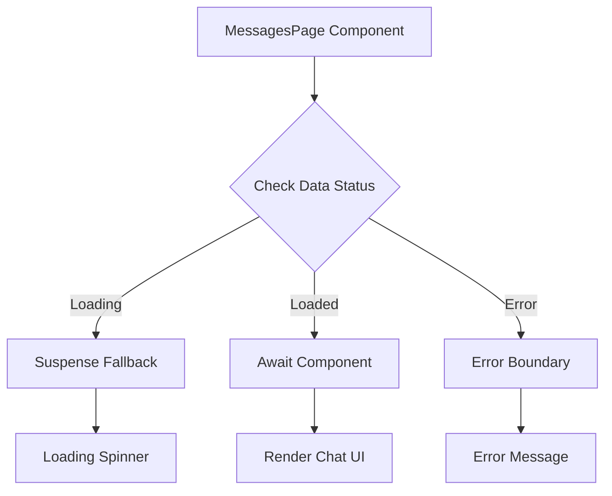
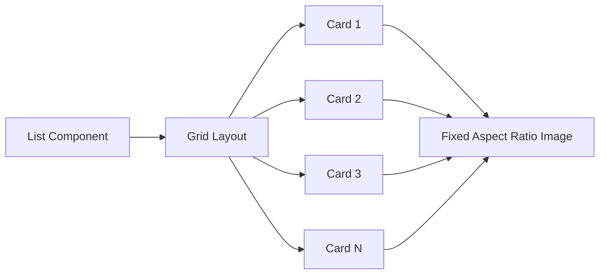
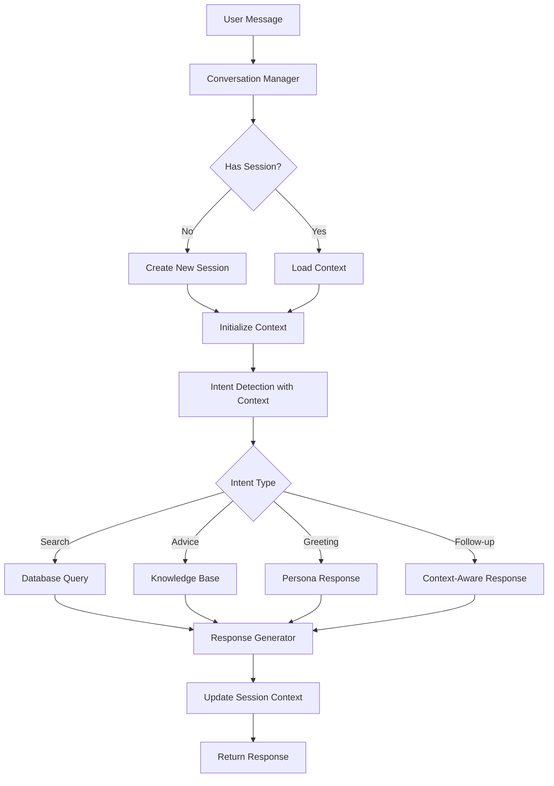
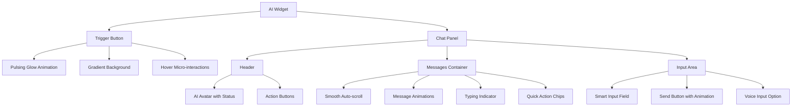

# Bug Fixes and UI Improvements Plan

## Overview

This document outlines the architectural plan to address critical bugs and UI improvements in the PrimeNest application. The issues are categorized into three main areas: Runtime Errors, Layout/Styling Issues, and Chatbot Overhaul.

---

## 1. Runtime Error: React Error #426 in MessagesPage

### Problem Analysis

**Error:** Minified React error #426 - This is a hydration error that occurs when server-rendered content does not match client-rendered content.

**Root Cause Investigation:**

1. **Missing Suspense Boundary:** The [`MessagesPage.jsx`](client/src/routes/messagesPage/MessagesPage.jsx:99) uses `<Await>` component without a proper Suspense boundary at the router level.

2. **Context Usage During SSR:** The component uses multiple contexts (`AuthContext`, `SocketContext`) that may have undefined values during server-side rendering.

3. **Deferred Data Loading:** The [`messagesLoader`](client/src/lib/loaders.js:26) returns deferred data, but the component structure may not properly handle the loading state.

### Solution Architecture



### Implementation Steps

1. **Add Suspense Boundary in Router:**
   - Modify [`App.jsx`](client/src/App.jsx:41) to wrap the messages route with a Suspense boundary
   - Add `fallback` prop with a proper loading component

2. **Fix Hydration Issues in MessagesPage:**
   - Ensure all context values have default/fallback values
   - Add client-side only guards for socket connections
   - Use `useEffect` for socket initialization instead of during render

3. **Improve Error Handling:**
   - Add proper error boundary around the `<Await>` component
   - Ensure graceful degradation when data fails to load

### Code Changes Required

**File: [`client/src/App.jsx`](client/src/App.jsx)**
```jsx
// Add Suspense import
import { Suspense } from "react";

// Wrap messages route
{
  path: "/messages",
  element: (
    <Suspense fallback={<MessagesLoadingFallback />}>
      <MessagesPage />
    </Suspense>
  ),
  loader: messagesLoader
}
```

**File: [`client/src/routes/messagesPage/MessagesPage.jsx`](client/src/routes/messagesPage/MessagesPage.jsx)**
```jsx
// Add guard for socket context
const { socket } = useContext(SocketContext) || {};

// Move socket initialization to useEffect
useEffect(() => {
  if (!socket) return;
  // socket logic here
}, [socket]);
```

---

## 2. Layout and Styling Issues

### 2.1 Hero Section Container Width

#### Problem Analysis

The hero section content appears cramped due to:
- Restrictive `max-width: 600px` on `.hero-content`
- Inadequate padding on smaller screens
- Grid layout not utilizing available space effectively

#### Solution

**File: [`client/src/routes/homePage/homePage.scss`](client/src/routes/homePage/homePage.scss)**

| Current | Proposed |
|---------|----------|
| `.hero-content { max-width: 600px; }` | `.hero-content { max-width: 720px; }` |
| `padding: 0 $space-6;` | `padding: 0 $space-8;` |
| Gap: `$space-12` | Gap: `$space-16` on desktop |

**Changes:**
1. Increase `.hero-content` max-width from 600px to 720px
2. Increase horizontal padding on `.hero-container` from `$space-6` to `$space-8`
3. Adjust grid gap from `$space-12` to `$space-16` for better breathing room
4. Update responsive breakpoints for better mobile experience

### 2.2 My Listings Page - Property Images Too Large

#### Problem Analysis

The [`List.jsx`](client/src/components/list/List.jsx) component uses a flexbox column layout:
```scss
.list {
  display: flex;
  flex-direction: column;
  gap: $space-5;
}
```

This causes cards to stack vertically at full width, making images appear excessively large.

#### Solution Architecture



#### Implementation

**File: [`client/src/components/list/list.scss`](client/src/components/list/list.scss)**

```scss
.list {
  display: grid;
  grid-template-columns: repeat(auto-fill, minmax(280px, 1fr));
  gap: $space-5;
  
  @include tablet {
    grid-template-columns: repeat(2, 1fr);
  }
  
  @include mobile {
    grid-template-columns: 1fr;
  }
}
```

**File: [`client/src/components/card/card.scss`](client/src/components/card/card.scss)**

Ensure consistent card sizing:
```scss
.card {
  width: 100%;
  max-width: 100%;
  
  .card-image {
    aspect-ratio: 16 / 10;
    max-height: 200px;
  }
}
```

### 2.3 Search Listings Page - Horizontal Overflow

#### Problem Analysis

The horizontal overflow is caused by:
1. Filter component not constraining width properly
2. Grid layout not handling dynamic content well
3. Missing `overflow: hidden` on parent containers

#### Solution

**File: [`client/src/routes/listPage/listPage.scss`](client/src/routes/listPage/listPage.scss)**

```scss
.list-page {
  display: flex;
  flex-direction: column;
  height: calc(100vh - 80px);
  background: var(--bg-primary);
  overflow-x: hidden; // Add this
}

.properties-section {
  overflow-x: hidden; // Add this
  min-width: 0; // Add this for flexbox overflow fix
}

.properties-grid {
  display: grid;
  grid-template-columns: repeat(auto-fill, minmax(280px, 1fr));
  gap: $space-4;
  width: 100%; // Ensure full width
  min-width: 0; // Fix grid overflow
}
```

**File: [`client/src/components/filter/Filter.jsx`](client/src/components/filter/Filter.jsx)**

Add overflow constraints to filter dropdowns and inputs.

---

## 3. Chatbot Overhaul

### 3.1 Backend: Conversational AI Implementation

#### Current Issues

1. **No Conversation Memory:** Each message is treated independently
2. **Limited Context:** Intent detection is too simplistic
3. **Repetitive Responses:** Same search results returned regardless of query nuance
4. **No Real Estate Expertise:** Generic responses instead of domain-specific knowledge

#### Proposed Architecture



#### Implementation Plan

**File: [`api/controllers/assistant.controller.js`](api/controllers/assistant.controller.js)**

1. **Add Conversation Memory:**
```javascript
// Session storage for conversation context
const conversationSessions = new Map();

const getSessionContext = (sessionId) => {
  if (!conversationSessions.has(sessionId)) {
    conversationSessions.set(sessionId, {
      history: [],
      lastIntent: null,
      lastLocation: null,
      preferences: {},
      createdAt: Date.now()
    });
  }
  return conversationSessions.get(sessionId);
};
```

2. **Enhanced System Prompt:**
```javascript
const systemPrompt = `
You are "Runo," PrimeNest's expert AI real estate consultant.

PERSONALITY:
- Professional yet approachable
- Knowledgeable about real estate markets, trends, and advice
- Proactive in asking clarifying questions
- Memory of conversation context

CAPABILITIES:
- Property search with specific criteria
- Market analysis and pricing advice
- Neighborhood recommendations
- Investment guidance
- Mortgage and financing tips

CONVERSATION FLOW:
1. Understand user needs through questions
2. Provide personalized recommendations
3. Offer to refine search or provide more details
4. Remember previous context in follow-up questions

Current conversation context:
- Previous intent: ${context.lastIntent || 'None'}
- Previous location: ${context.lastLocation || 'None'}
- User preferences: ${JSON.stringify(context.preferences)}
- Recent messages: ${context.history.slice(-3).map(m => `${m.role}: ${m.content}`).join('\n')}
`;
```

3. **Context-Aware Response Generation:**
```javascript
const generateResponse = async (message, context, sessionId) => {
  // Update context with new message
  context.history.push({ role: 'user', content: message });
  
  // Generate response with full context
  const response = await ai.models.generateContent({
    model: "gemini-2.0-flash",
    contents: context.history.map(m => ({
      role: m.role,
      parts: [{ text: m.content }]
    })),
    config: {
      systemInstruction: systemPrompt,
      temperature: 0.7,
      maxOutputTokens: 800,
    }
  });
  
  // Update context with response
  context.history.push({ role: 'model', content: response.text });
  context.lastIntent = detectedIntent;
  
  return response;
};
```

### 3.2 Frontend: Chatbot UI Overhaul - Premium Experience

#### Current Issues

1. **Scrolling Problem:** Page scrolls instead of message container
2. **Layout Issues:** Messages overflow container
3. **UX Problems:** No typing indicator, poor feedback
4. **Visual Design:** Not polished enough for flagship feature

#### Premium UI Enhancement Strategy

The AI chatbot is the website's pride and joy - it needs to feel premium, polished, and delightful to use.



#### Solution: Comprehensive UI Overhaul

**File: [`client/src/components/ai-widget/aiWidget.scss`](client/src/components/ai-widget/aiWidget.scss)**

```scss
// ============================================
// Premium AI Widget - Flagship Feature
// ============================================

.widget-panel {
  width: 400px;
  height: 560px;
  max-height: calc(100vh - 100px);
  display: flex;
  flex-direction: column;
  overflow: hidden;
  background: var(--surface-glass);
  backdrop-filter: blur(24px);
  -webkit-backdrop-filter: blur(24px);
  border: 1px solid var(--border-glass);
  border-radius: $radius-3xl;
  box-shadow: 
    var(--shadow-2xl),
    0 0 60px rgba(99, 102, 241, 0.1),
    inset 0 1px 0 rgba(255, 255, 255, 0.1);
  
  @include mobile {
    position: fixed;
    inset: 0;
    width: 100%;
    height: 100%;
    max-height: 100%;
    border-radius: 0;
  }
}

// Messages Container - Properly Scrollable
.widget-messages {
  flex: 1;
  overflow-y: auto;
  overflow-x: hidden;
  padding: $space-4;
  display: flex;
  flex-direction: column;
  gap: $space-3;
  min-height: 0; // CRITICAL: Enables flexbox scrolling
  scroll-behavior: smooth;
  
  // Custom scrollbar
  &::-webkit-scrollbar {
    width: 6px;
  }
  
  &::-webkit-scrollbar-track {
    background: transparent;
  }
  
  &::-webkit-scrollbar-thumb {
    background: var(--border-medium);
    border-radius: $radius-full;
    
    &:hover {
      background: var(--accent-primary);
    }
  }
  
  // Message bubbles
  .message {
    max-width: 85%;
    word-wrap: break-word;
    animation: messageSlide 0.3s ease-out;
    
    .message-bubble {
      max-width: 100%;
      overflow-wrap: break-word;
      line-height: 1.5;
    }
  }
}

@keyframes messageSlide {
  from {
    opacity: 0;
    transform: translateY(10px);
  }
  to {
    opacity: 1;
    transform: translateY(0);
  }
}

// Premium Typing Indicator
.typing-indicator {
  display: flex;
  align-items: center;
  gap: 4px;
  padding: $space-3 $space-4;
  background: var(--surface-secondary);
  border-radius: $radius-xl;
  
  span {
    width: 8px;
    height: 8px;
    background: var(--accent-primary);
    border-radius: 50%;
    animation: typingPulse 1.4s ease-in-out infinite;
    
    &:nth-child(1) { animation-delay: 0s; }
    &:nth-child(2) { animation-delay: 0.15s; }
    &:nth-child(3) { animation-delay: 0.3s; }
  }
}

@keyframes typingPulse {
  0%, 60%, 100% {
    transform: translateY(0);
    opacity: 0.4;
  }
  30% {
    transform: translateY(-6px);
    opacity: 1;
  }
}

// Quick Action Chips
.quick-actions {
  display: flex;
  flex-wrap: wrap;
  gap: $space-2;
  padding: $space-3 $space-4;
  border-top: 1px solid var(--border-subtle);
  
  .quick-chip {
    padding: $space-2 $space-3;
    background: var(--surface-secondary);
    border: 1px solid var(--border-default);
    border-radius: $radius-full;
    font-size: $text-xs;
    color: var(--text-secondary);
    cursor: pointer;
    transition: all 0.2s ease;
    
    &:hover {
      background: var(--accent-primary-light);
      border-color: var(--accent-primary);
      color: var(--accent-primary);
    }
  }
}

// Premium Input Area
.widget-input {
  display: flex;
  align-items: center;
  gap: $space-2;
  padding: $space-4;
  background: var(--surface-secondary);
  border-top: 1px solid var(--border-subtle);
  
  input {
    flex: 1;
    padding: $space-3 $space-4;
    background: var(--input-bg);
    border: 1px solid var(--input-border);
    border-radius: $radius-xl;
    color: var(--text-primary);
    font-size: $text-sm;
    transition: all 0.2s ease;
    
    &:focus {
      outline: none;
      border-color: var(--accent-primary);
      box-shadow: 0 0 0 3px var(--accent-primary-light);
    }
    
    &::placeholder {
      color: var(--text-tertiary);
    }
  }
  
  .send-btn {
    display: flex;
    align-items: center;
    justify-content: center;
    width: 44px;
    height: 44px;
    background: var(--brand-gradient);
    border: none;
    border-radius: $radius-xl;
    color: white;
    cursor: pointer;
    transition: all 0.2s ease;
    
    &:hover:not(:disabled) {
      transform: scale(1.05);
      box-shadow: 0 0 20px rgba(99, 102, 241, 0.4);
    }
    
    &:active {
      transform: scale(0.95);
    }
    
    &:disabled {
      opacity: 0.5;
      cursor: not-allowed;
    }
  }
}
```

**File: [`client/src/components/ai-widget/AIWidget.jsx`](client/src/components/ai-widget/AIWidget.jsx)**

1. **Add Session ID for Context:**
```jsx
const [sessionId] = useState(() => 
  `session_${Date.now()}_${Math.random().toString(36).substr(2, 9)}`
);
```

2. **Update API Call:**
```jsx
const res = await apiRequest.post("/assistant/chat", { 
  message: userQuery,
  sessionId: sessionId 
});
```

3. **Premium Scrolling with Smooth Animation:**
```jsx
const messagesContainerRef = useRef(null);

// Smooth scroll to bottom
const scrollToBottom = () => {
  if (messagesContainerRef.current) {
    messagesContainerRef.current.scrollTo({
      top: messagesContainerRef.current.scrollHeight,
      behavior: 'smooth'
    });
  }
};

useEffect(() => {
  scrollToBottom();
}, [messages]);
```

4. **Quick Action Chips for Common Queries:**
```jsx
const quickActions = [
  "Find apartments in Lagos",
  "Houses under ₦5M",
  "2 bedroom flats for rent",
  "Investment properties"
];

const handleQuickAction = (action) => {
  setInput(action);
  handleSend(action);
};
```

5. **Enhanced Message Rendering with Markdown Support:**
```jsx
// Add markdown rendering for rich responses
import ReactMarkdown from 'react-markdown';

// In message bubble
<div className="message-bubble">
  <ReactMarkdown>{m.text}</ReactMarkdown>
  {m.link && (
    <Link to={m.link} className="action-link" onClick={closeWidget}>
      View Listings
      <ArrowRight size={14} />
    </Link>
  )}
</div>
```

---

## Implementation Priority

| Priority | Issue | Impact | Effort |
|----------|-------|--------|--------|
| 1 | React Error #426 | Critical - App Crash | Medium |
| 2 | Chatbot Scrolling | High - UX Broken | Low |
| 3 | Listings Page Overflow | High - Layout Broken | Low |
| 4 | Hero Section Width | Medium - Visual | Low |
| 5 | My Listings Images | Medium - Visual | Low |
| 6 | Chatbot Backend | High - Core Feature | High |

---

## Testing Strategy

### 1. Runtime Error Testing
- Test MessagesPage navigation in production build
- Verify SSR/client hydration matches
- Test with slow network conditions

### 2. Layout Testing
- Test on various screen sizes (320px - 1920px)
- Verify no horizontal overflow on all pages
- Check image sizing on profile page

### 3. Chatbot Testing
- Test multi-turn conversations
- Verify context retention across messages
- Test scrolling behavior with long conversations
- Verify search integration works correctly

---

## Files to Modify

### Frontend
1. `client/src/App.jsx` - Add Suspense boundary
2. `client/src/routes/messagesPage/MessagesPage.jsx` - Fix hydration issues
3. `client/src/routes/homePage/homePage.scss` - Adjust hero container
4. `client/src/components/list/list.scss` - Change to grid layout
5. `client/src/components/card/card.scss` - Constrain image sizes
6. `client/src/routes/listPage/listPage.scss` - Fix overflow issues
7. `client/src/components/filter/filter.scss` - Add overflow constraints
8. `client/src/components/ai-widget/AIWidget.jsx` - Add session ID, fix scrolling
9. `client/src/components/ai-widget/aiWidget.scss` - Fix scroll container

### Backend
1. `api/controllers/assistant.controller.js` - Implement conversation memory

---

## Estimated Effort

- **Runtime Error Fix:** 2-3 hours
- **Layout Fixes:** 1-2 hours
- **Chatbot UI Fix:** 1 hour
- **Chatbot Backend Overhaul:** 4-6 hours

**Total:** 8-12 hours of development work