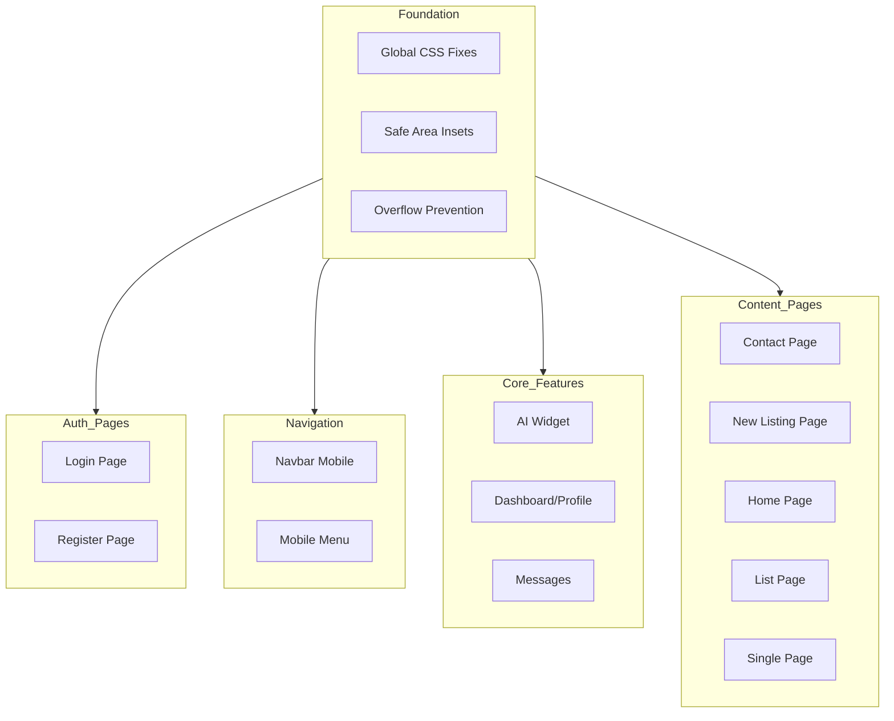

# Comprehensive Mobile Responsiveness Audit & Overhaul Plan

## Executive Summary

This plan addresses all mobile responsiveness issues across the PrimeNest real estate platform. The audit identified critical issues affecting user experience on mobile devices, including layout problems, invisible UI elements, overflow issues, and unreadable content.

---

## Audit Findings Summary

### Critical Issues Identified

| Issue | Location | Severity | Impact |
|-------|----------|----------|--------|
| Login/Register pages split/pushed | [`login.scss`](client/src/routes/login/login.scss) | HIGH | Users cannot access authentication |
| Navbar icons invisible | [`navbar.scss`](client/src/components/navbar/navbar.scss) | HIGH | Navigation broken |
| AI Widget overflow | [`aiWidget.scss`](client/src/components/ai-widget/aiWidget.scss) | HIGH | Feature unusable |
| Horizontal scrolling | Multiple pages | HIGH | Content cut off |
| Dashboard unreadable | [`profilePage.scss`](client/src/routes/profilePage/profilePage.scss) | HIGH | Core feature broken |
| Messages page layout | [`messagesPage.scss`](client/src/routes/messagesPage/messagesPage.scss) | MEDIUM | Chat difficult to use |
| Contact page layout | [`contactPage.scss`](client/src/routes/contactPage/contactPage.scss) | MEDIUM | Form submission affected |
| New Listing page layout | [`newPostPage.scss`](client/src/routes/newPostPage/newPostPage.scss) | MEDIUM | Listing creation difficult |

---

## Architecture Overview



---

## Phase 1: Foundation Fixes

### 1.1 Global Overflow Prevention

**File:** [`client/src/index.scss`](client/src/index.scss)

**Current State:** Lines 27-51 have basic overflow control but needs reinforcement.

**Changes Required:**
```scss
// Add stronger overflow prevention
html {
  scroll-behavior: smooth;
  font-size: 16px;
  -webkit-text-size-adjust: 100%;
  overflow-x: hidden;
  max-width: 100vw;
  
  @include mobile {
    font-size: 15px;
  }
}

body {
  font-family: $font-primary;
  font-size: $text-base;
  line-height: $leading-normal;
  background-color: var(--bg-primary);
  color: var(--text-primary);
  -webkit-font-smoothing: antialiased;
  -moz-osx-font-smoothing: grayscale;
  overflow-x: hidden;
  max-width: 100vw;
  min-height: 100vh;
  transition: background-color 0.3s ease, color 0.3s ease;
  
  // Add touch optimization
  -webkit-tap-highlight-color: transparent;
  -webkit-touch-callout: none;
}

// Ensure all containers respect viewport
#root {
  min-height: 100vh;
  max-width: 100vw;
  overflow-x: hidden;
  display: flex;
  flex-direction: column;
}

// Global rule for all children
* {
  max-width: 100%;
}

// Fix for common overflow culprits
img, video, iframe, canvas {
  max-width: 100%;
  height: auto;
}
```

### 1.2 Safe Area Insets Enhancement

**Current State:** Lines 54-61 have basic safe area support.

**Changes Required:**
```scss
// Enhanced safe area support for iOS notched devices
@supports (padding: env(safe-area-inset-top)) {
  body {
    padding-top: env(safe-area-inset-top);
    padding-bottom: env(safe-area-inset-bottom);
    padding-left: env(safe-area-inset-left);
    padding-right: env(safe-area-inset-right);
  }
  
  // For fixed elements
  .navbar, .mobile-bottom-nav, .mobile-cta-bar {
    padding-top: env(safe-area-inset-top);
  }
  
  // For bottom fixed elements
  .ai-widget, .mobile-bottom-nav, .mobile-cta-bar {
    padding-bottom: env(safe-area-inset-bottom);
  }
}
```

---

## Phase 2: Authentication Pages Fix

### 2.1 Login Page Mobile Layout

**File:** [`client/src/routes/login/login.scss`](client/src/routes/login/login.scss)

**Problem:** The auth-page uses `grid-template-columns: 1fr 1fr` which splits the page on larger screens. On mobile, the `@include lg` breakpoint at 1366px switches to single column, but the form may still be pushed to the side.

**Current Code (Lines 12-25):**
```scss
.auth-page {
  display: grid;
  grid-template-columns: 1fr 1fr;
  min-height: calc(100vh - 64px);
  background: var(--bg-primary);

  @include lg {
    grid-template-columns: 1fr;
  }

  @include mobile {
    min-height: calc(100vh - 56px);
  }
}
```

**Changes Required:**
```scss
.auth-page {
  display: grid;
  grid-template-columns: 1fr 1fr;
  min-height: calc(100vh - 64px);
  background: var(--bg-primary);

  @include lg {
    grid-template-columns: 1fr;
  }

  @include mobile {
    min-height: calc(100vh - 56px);
    display: flex;
    flex-direction: column;
  }
}

// Form section mobile optimization
.auth-form-section {
  display: flex;
  align-items: center;
  justify-content: center;
  padding: $space-8;
  width: 100%;
  max-width: 100vw;
  box-sizing: border-box;

  @include mobile {
    padding: $space-6 $space-4;
    min-height: calc(100vh - 56px);
    order: 2;
  }
}

.auth-form-container {
  width: 100%;
  max-width: 400px;
  padding: 0 $space-4;
  box-sizing: border-box;
  
  @include mobile {
    max-width: 100%;
  }
}

// Image section should hide on mobile
.auth-image-section {
  @include mobile {
    display: none;
  }
}
```

### 2.2 Register Page Mobile Layout

**File:** [`client/src/routes/register/register.scss`](client/src/routes/register/register.scss)

**Changes Required:**
```scss
.auth-page {
  // Ensure proper stacking on mobile
  @include mobile {
    display: flex;
    flex-direction: column;
  }
  
  .auth-image-section {
    order: 1;
    
    @include mobile {
      display: none;
    }
  }

  .auth-form-section {
    order: 2;
    
    @include mobile {
      order: 1;
      width: 100%;
    }
  }
}
```

---

## Phase 3: Navigation Fixes

### 3.1 Navbar Mobile Icons

**File:** [`client/src/components/navbar/navbar.scss`](client/src/components/navbar/navbar.scss)

**Problem:** Icon buttons are too small (36px) and may have visibility issues on mobile.

**Current Code (Lines 144-162):**
```scss
.icon-btn {
  display: flex;
  align-items: center;
  justify-content: center;
  width: 36px;
  height: 36px;
  // ...
}
```

**Changes Required:**
```scss
// Desktop icon buttons
.icon-btn {
  display: flex;
  align-items: center;
  justify-content: center;
  width: 36px;
  height: 36px;
  background: var(--surface-secondary);
  border: 1px solid var(--border-subtle);
  border-radius: $radius-lg;
  color: var(--text-secondary);
  cursor: pointer;
  transition: all 0.15s ease;

  &:hover {
    background: var(--surface-hover);
    color: var(--text-primary);
    border-color: var(--border-emphasis);
  }
  
  // Mobile adjustments
  @include mobile {
    width: 44px;
    height: 44px;
    background: var(--surface-hover);
    color: var(--text-primary);
    border-color: var(--border-emphasis);
    
    svg {
      width: 20px;
      height: 20px;
    }
  }
}

// Logo icon mobile
.logo {
  .logo-icon {
    display: flex;
    align-items: center;
    justify-content: center;
    width: 36px;
    height: 36px;
    background: var(--brand-gradient);
    border-radius: $radius-lg;
    color: white;
    box-shadow: var(--shadow-md);
    
    @include mobile {
      width: 40px;
      height: 40px;
      
      svg {
        width: 20px;
        height: 20px;
      }
    }
  }
}

// Menu toggle button
.menu-toggle {
  display: none;
  align-items: center;
  justify-content: center;
  width: 40px;
  height: 40px;
  background: transparent;
  border: none;
  color: var(--text-primary);
  cursor: pointer;
  border-radius: $radius-lg;
  transition: all 0.15s ease;

  &:hover {
    background: var(--surface-hover);
  }

  @include mobile {
    display: flex;
    width: 44px;
    height: 44px;
    background: var(--surface-secondary);
    border: 1px solid var(--border-subtle);
    
    svg {
      width: 24px;
      height: 24px;
    }
  }
}
```

### 3.2 Mobile Menu Enhancement

**Current Code (Lines 421-463):**

**Changes Required:**
```scss
.mobile-menu {
  position: fixed;
  top: 0;
  right: 0;
  width: 320px;
  max-width: 85vw;
  height: 100vh;
  height: 100dvh;
  background: var(--bg-primary);
  z-index: $z-index-modal;
  box-shadow: var(--shadow-2xl);
  padding-top: env(safe-area-inset-top);
  padding-bottom: env(safe-area-inset-bottom);
  
  @include xs {
    width: 100%;
    max-width: 100vw;
  }

  .mobile-menu-content {
    display: flex;
    flex-direction: column;
    height: 100%;
    padding: $space-6 $space-4;
    overflow-y: auto;
  }

  .mobile-menu-header {
    margin-bottom: $space-6;
    padding-bottom: $space-4;
    border-bottom: 1px solid var(--border-default);

    .mobile-brand {
      display: flex;
      align-items: center;
      gap: $space-3;
      font-size: $text-xl;
      font-weight: $font-weight-bold;
      color: var(--text-primary);

      svg {
        color: var(--accent-primary);
        width: 24px;
        height: 24px;
      }
    }
  }

  .mobile-nav-links {
    display: flex;
    flex-direction: column;
    gap: $space-2;
    flex: 1;

    .mobile-nav-link {
      display: flex;
      align-items: center;
      gap: $space-3;
      padding: $space-4;
      font-size: $text-base;
      font-weight: $font-weight-medium;
      color: var(--text-secondary);
      text-decoration: none;
      border-radius: $radius-lg;
      transition: all 0.15s ease;
      min-height: 56px; // Touch-friendly target
      
      svg {
        width: 20px;
        height: 20px;
      }
    }
  }
}
```

---

## Phase 4: AI Widget Mobile Fix

### 4.1 Widget Positioning and Overflow

**File:** [`client/src/components/ai-widget/aiWidget.scss`](client/src/components/ai-widget/aiWidget.scss)

**Problem:** The widget panel can overflow the viewport on mobile, causing horizontal scrolling. Additionally, the header action buttons (minimize, new chat, close) are indistinguishable - users cannot tell which button does what.

**Current Code (Lines 9-138):**

**Changes Required:**
```scss
.ai-widget {
  position: fixed;
  bottom: $space-6;
  right: $space-6;
  z-index: $z-index-modal;
  
  @include mobile {
    bottom: $space-4;
    right: $space-4;
    left: $space-4;
    width: auto;
  }
}

// Trigger button - ensure visibility
.widget-trigger {
  position: relative;
  display: flex;
  align-items: center;
  justify-content: center;
  width: 60px;
  height: 60px;
  background: var(--brand-gradient);
  border: none;
  border-radius: $radius-full;
  color: white;
  cursor: pointer;
  box-shadow: 
    var(--shadow-lg),
    0 0 30px rgba(99, 102, 241, 0.3);
  transition: all 0.3s ease;
  
  @include mobile {
    width: 56px;
    height: 56px;
    position: absolute;
    bottom: 0;
    right: 0;
    
    svg {
      width: 24px;
      height: 24px;
    }
  }
}

// Widget panel - full screen on mobile
.widget-panel {
  width: 400px;
  height: 580px;
  max-height: calc(100vh - 100px);
  display: flex;
  flex-direction: column;
  background: var(--surface-glass);
  backdrop-filter: blur(24px);
  -webkit-backdrop-filter: blur(24px);
  border: 1px solid var(--border-glass);
  border-radius: $radius-3xl;
  box-shadow: 
    var(--shadow-2xl),
    0 0 60px rgba(99, 102, 241, 0.1),
    inset 0 1px 0 rgba(255, 255, 255, 0.1);
  overflow: hidden;

  @include mobile {
    position: fixed;
    top: 0;
    left: 0;
    right: 0;
    bottom: 0;
    width: 100%;
    height: 100%;
    max-height: 100%;
    max-width: 100%;
    border-radius: 0;
    padding-top: env(safe-area-inset-top);
    padding-bottom: env(safe-area-inset-bottom);
  }
}

// Header buttons with clear visual distinction
.widget-header {
  .header-actions {
    display: flex;
    align-items: center;
    gap: $space-2;
    
    button {
      display: flex;
      align-items: center;
      justify-content: center;
      width: 36px;
      height: 36px;
      background: rgba(255, 255, 255, 0.2);
      border: 1px solid var(--border-glass);
      border-radius: $radius-lg;
      color: var(--text-primary);
      cursor: pointer;
      transition: all 0.2s ease;
      position: relative;
      
      // Add visible labels for each button
      &::after {
        position: absolute;
        bottom: -20px;
        left: 50%;
        transform: translateX(-50%);
        font-size: 10px;
        color: var(--text-tertiary);
        white-space: nowrap;
        opacity: 0;
        transition: opacity 0.2s ease;
        pointer-events: none;
      }
      
      @include mobile {
        width: 44px;
        height: 44px;
        background: rgba(255, 255, 255, 0.25);
        
        svg {
          width: 20px;
          height: 20px;
        }
      }

      // New Chat button - green accent
      &:nth-child(1) {
        background: rgba(16, 185, 129, 0.2);
        border-color: rgba(16, 185, 129, 0.3);
        
        svg {
          color: #10B981;
        }
        
        &:hover {
          background: #10B981;
          border-color: #10B981;
          
          svg {
            color: white;
          }
        }
      }
      
      // Minimize button - yellow/amber accent
      &:nth-child(2) {
        background: rgba(245, 158, 11, 0.2);
        border-color: rgba(245, 158, 11, 0.3);
        
        svg {
          color: #F59E0B;
        }
        
        &:hover {
          background: #F59E0B;
          border-color: #F59E0B;
          
          svg {
            color: white;
          }
        }
      }
      
      // Close button - red accent
      &:nth-child(3) {
        background: rgba(239, 68, 68, 0.2);
        border-color: rgba(239, 68, 68, 0.3);
        
        svg {
          color: #EF4444;
        }
        
        &:hover {
          background: #EF4444;
          border-color: #EF4444;
          
          svg {
            color: white;
          }
        }
      }
    }
  }
}

// Dark mode adjustments for header buttons
[data-theme="dark"] {
  .widget-header .header-actions button {
    // New Chat - green
    &:nth-child(1) {
      background: rgba(16, 185, 129, 0.15);
      border-color: rgba(16, 185, 129, 0.25);
    }
    
    // Minimize - amber
    &:nth-child(2) {
      background: rgba(245, 158, 11, 0.15);
      border-color: rgba(245, 158, 11, 0.25);
    }
    
    // Close - red
    &:nth-child(3) {
      background: rgba(239, 68, 68, 0.15);
      border-color: rgba(239, 68, 68, 0.25);
    }
  }
}

// Input area mobile
.widget-input {
  display: flex;
  align-items: center;
  gap: $space-2;
  padding: $space-4;
  background: var(--surface-secondary);
  border-top: 1px solid var(--border-subtle);
  
  @include mobile {
    padding: $space-3;
    padding-bottom: calc($space-3 + env(safe-area-inset-bottom));
  }

  input {
    flex: 1;
    padding: $space-3 $space-4;
    background: var(--input-bg);
    border: 1px solid var(--input-border);
    border-radius: $radius-xl;
    color: var(--text-primary);
    font-size: $text-sm;
    min-height: 48px;
    transition: all 0.2s ease;
    
    @include mobile {
      font-size: 16px; // Prevents iOS zoom
    }
  }

  .send-btn {
    width: 44px;
    height: 44px;
    
    @include mobile {
      width: 48px;
      height: 48px;
    }
  }
}
```

### 4.2 AI Widget JSX Changes for Button Labels

**File:** [`client/src/components/ai-widget/AIWidget.jsx`](client/src/components/ai-widget/AIWidget.jsx)

**Problem:** The buttons only have `title` attributes which don't show on mobile. Need to add visible labels or tooltips.

**Current Code (Lines 234-259):**
```jsx
<div className="header-actions">
  <motion.button
    onClick={handleNewChat}
    title="New Chat"
    whileHover={{ scale: 1.1 }}
    whileTap={{ scale: 0.9 }}
  >
    <Plus size={16} />
  </motion.button>
  <motion.button
    onClick={minimizeWidget}
    title="Minimize"
    whileHover={{ scale: 1.1 }}
    whileTap={{ scale: 0.9 }}
  >
    <Minus size={16} />
  </motion.button>
  <motion.button
    onClick={closeWidget}
    title="Close"
    whileHover={{ scale: 1.1 }}
    whileTap={{ scale: 0.9 }}
  >
    <X size={16} />
  </motion.button>
</div>
```

**Changes Required:**
```jsx
<div className="header-actions">
  <motion.button
    onClick={handleNewChat}
    className="new-chat-btn"
    whileHover={{ scale: 1.1 }}
    whileTap={{ scale: 0.9 }}
    aria-label="Start new chat"
  >
    <Plus size={16} />
    <span className="btn-label">New</span>
  </motion.button>
  <motion.button
    onClick={minimizeWidget}
    className="minimize-btn"
    whileHover={{ scale: 1.1 }}
    whileTap={{ scale: 0.9 }}
    aria-label="Minimize widget"
  >
    <Minus size={16} />
    <span className="btn-label">Min</span>
  </motion.button>
  <motion.button
    onClick={closeWidget}
    className="close-btn"
    whileHover={{ scale: 1.1 }}
    whileTap={{ scale: 0.9 }}
    aria-label="Close widget"
  >
    <X size={16} />
    <span className="btn-label">Close</span>
  </motion.button>
</div>
```

**Additional SCSS for button labels:**
```scss
.header-actions {
  button {
    .btn-label {
      display: none;
      position: absolute;
      bottom: -18px;
      left: 50%;
      transform: translateX(-50%);
      font-size: 9px;
      font-weight: $font-weight-medium;
      color: var(--text-tertiary);
      white-space: nowrap;
      
      @include mobile {
        display: block;
      }
    }
    
    @include mobile {
      position: relative;
      margin-bottom: 16px; // Space for label
    }
  }
}
```

---

## Phase 5: Dashboard/Profile Page Fix

### 5.1 Profile Page Mobile Layout

**File:** [`client/src/routes/profilePage/profilePage.scss`](client/src/routes/profilePage/profilePage.scss)

**Problem:** The dashboard uses a 2-column layout (`grid-template-columns: 320px 1fr`) which makes the sidebar too narrow and content unreadable on mobile.

**Current Code (Lines 8-42):**

**Changes Required:**
```scss
.profile-page {
  display: grid;
  grid-template-columns: 320px 1fr;
  min-height: calc(100vh - 80px);
  background: var(--bg-primary);

  @include lg {
    grid-template-columns: 280px 1fr;
  }

  @include md {
    grid-template-columns: 1fr;
  }
  
  @include mobile {
    display: flex;
    flex-direction: column;
    min-height: calc(100vh - 56px);
  }
}

// Sidebar mobile behavior
.profile-sidebar {
  background: var(--surface-primary);
  border-right: 1px solid var(--border-light);
  padding: $space-6;
  position: sticky;
  top: 80px;
  height: calc(100vh - 80px);
  overflow-y: auto;

  @include md {
    position: relative;
    top: 0;
    height: auto;
    border-right: none;
    border-bottom: 1px solid var(--border-light);
  }
  
  @include mobile {
    padding: $space-4;
    position: relative;
    top: 0;
    height: auto;
    overflow: visible;
    
    // Collapsible sidebar on mobile
    .sidebar-content {
      display: flex;
      flex-direction: column;
    }
  }
}

// User card mobile
.user-card {
  display: flex;
  flex-direction: column;
  align-items: center;
  text-align: center;
  padding: $space-6;
  background: linear-gradient(135deg, var(--surface-secondary) 0%, var(--surface-tertiary) 100%);
  border-radius: $radius-2xl;
  border: 1px solid var(--border-light);
  
  @include mobile {
    padding: $space-4;
    border-radius: $radius-xl;
  }
}

.user-avatar {
  position: relative;
  margin-bottom: $space-4;

  img {
    width: 80px;
    height: 80px;
    border-radius: $radius-xl;
    object-fit: cover;
    border: 3px solid var(--accent-primary);
    
    @include mobile {
      width: 64px;
      height: 64px;
    }
  }
}

// Main content area
.profile-main {
  padding: $space-8;
  overflow-y: auto;

  @include md {
    padding: $space-5;
  }
  
  @include mobile {
    padding: $space-4;
    overflow: visible;
  }
}

// Section header mobile
.section-header {
  display: flex;
  align-items: flex-start;
  justify-content: space-between;
  margin-bottom: $space-8;
  gap: $space-4;

  @include sm {
    flex-direction: column;
    align-items: stretch;
  }
  
  @include mobile {
    margin-bottom: $space-4;
    flex-direction: column;
    gap: $space-3;
  }
}

.header-content {
  h1 {
    font-size: $font-size-3xl;
    font-weight: $font-weight-bold;
    color: var(--text-primary);
    margin-bottom: $space-1;
    letter-spacing: -0.02em;

    @include sm {
      font-size: $font-size-2xl;
    }
    
    @include mobile {
      font-size: $text-xl;
    }
  }
}

// Navigation items mobile
.nav-item {
  display: flex;
  align-items: center;
  gap: $space-3;
  width: 100%;
  padding: $space-4;
  background: transparent;
  border: none;
  border-radius: $radius-lg;
  font-size: $font-size-base;
  font-weight: $font-weight-medium;
  color: var(--text-secondary);
  cursor: pointer;
  transition: all 0.2s ease;
  text-align: left;
  min-height: 56px;
  
  @include mobile {
    padding: $space-3;
    min-height: 52px;
    
    svg {
      width: 20px;
      height: 20px;
    }
  }
}
```

---

## Phase 6: Messages Page Optimization

### 6.1 Messages Page Mobile Layout

**File:** [`client/src/routes/messagesPage/messagesPage.scss`](client/src/routes/messagesPage/messagesPage.scss)

**Current State:** The page already has mobile styles but needs refinement.

**Changes Required:**
```scss
.messages-page {
  min-height: calc(100vh - 80px);
  background: var(--bg-primary);
  padding: $space-6;
  
  @include mobile {
    padding: 0;
    min-height: calc(100vh - 56px);
  }
}

.messages-container {
  display: grid;
  grid-template-columns: 360px 1fr;
  max-width: 1400px;
  margin: 0 auto;
  height: calc(100vh - 140px);
  background: var(--bg-elevated);
  border-radius: $radius-2xl;
  overflow: hidden;
  box-shadow: var(--shadow-xl);

  @include lg {
    grid-template-columns: 320px 1fr;
  }

  @include mobile {
    display: flex;
    position: relative;
    height: calc(100vh - 56px);
    border-radius: 0;
    max-width: 100%;
  }
}

// Conversations sidebar
.conversations-sidebar {
  display: flex;
  flex-direction: column;
  background: var(--bg-secondary);
  border-right: 1px solid var(--border-subtle);
  height: 100%;
  min-height: 0;

  @include mobile {
    position: absolute;
    inset: 0;
    z-index: 10;
    width: 100%;
    transform: translateX(0);
    transition: transform 0.3s ease;
    border-right: none;

    &:not(.open) {
      transform: translateX(-100%);
    }
  }
}

// Chat window
.chat-window {
  display: flex;
  flex-direction: column;
  background: var(--bg-primary);
  height: 100%;
  min-height: 0;
  flex: 1;

  @include mobile {
    position: absolute;
    inset: 0;
    z-index: 5;
    transform: translateX(100%);
    transition: transform 0.3s ease;

    &.open {
      transform: translateX(0);
    }
  }
}

// Chat header with back button
.chat-header {
  .back-btn {
    display: none;
    align-items: center;
    justify-content: center;
    width: 40px;
    height: 40px;
    background: var(--surface-secondary);
    border: none;
    border-radius: $radius-lg;
    color: var(--text-secondary);
    cursor: pointer;
    transition: all 0.15s ease;

    @include mobile {
      display: flex;
      width: 44px;
      height: 44px;
    }
  }
}

// Message bubbles
.chat-messages {
  .message {
    max-width: 70%;

    @include mobile {
      max-width: 85%;
    }
  }
}

// Chat input
.chat-input {
  display: flex;
  align-items: center;
  gap: $space-2;
  padding: $space-4;
  background: var(--surface-secondary);
  border-top: 1px solid var(--border-subtle);
  
  @include mobile {
    padding: $space-3;
    padding-bottom: calc($space-3 + env(safe-area-inset-bottom));
  }
  
  input {
    flex: 1;
    padding: $space-3 $space-4;
    min-height: 48px;
    font-size: 16px; // Prevents iOS zoom
    
    @include mobile {
      padding: $space-3;
    }
  }
}
```

---

## Phase 7: Contact Page Optimization

### 7.1 Contact Page Mobile Layout

**File:** [`client/src/routes/contactPage/contactPage.scss`](client/src/routes/contactPage/contactPage.scss)

**Changes Required:**
```scss
.contact-page {
  display: grid;
  grid-template-columns: 1fr 1fr;
  min-height: calc(100vh - 80px);
  background: var(--bg-primary);

  @include lg {
    grid-template-columns: 1fr;
  }
  
  @include mobile {
    display: flex;
    flex-direction: column;
    min-height: calc(100vh - 56px);
  }
}

// Info section
.contact-info-section {
  background: linear-gradient(135deg, var(--accent-primary), var(--accent-secondary));
  padding: $space-12;
  display: flex;
  align-items: center;

  @include lg {
    padding: $space-10 $space-6;
  }
  
  @include mobile {
    padding: $space-6 $space-4;
    order: 1;
  }
}

.info-content {
  max-width: 500px;
  color: white;
  
  @include mobile {
    max-width: 100%;
  }
  
  h1 {
    font-size: $font-size-4xl;
    
    @include mobile {
      font-size: $text-2xl;
    }
  }
}

// Form section
.contact-form-section {
  display: flex;
  align-items: center;
  justify-content: center;
  padding: $space-12;

  @include lg {
    padding: $space-10 $space-6;
  }
  
  @include mobile {
    padding: $space-6 $space-4;
    order: 2;
  }
}

.form-container {
  width: 100%;
  max-width: 480px;
  
  @include mobile {
    max-width: 100%;
  }
}

// Form inputs mobile
.input-wrapper {
  input {
    padding: $space-4 $space-4 $space-4 $space-12;
    min-height: 48px;
    font-size: 16px; // Prevents iOS zoom
    
    @include mobile {
      padding: $space-3 $space-4 $space-3 $space-12;
    }
  }
}

.submit-button {
  padding: $space-4;
  min-height: 52px;
  
  @include mobile {
    padding: $space-3;
    min-height: 48px;
  }
}
```

---

## Phase 8: New Listing Page Optimization

### 8.1 New Post Page Mobile Layout

**File:** [`client/src/routes/newPostPage/newPostPage.scss`](client/src/routes/newPostPage/newPostPage.scss)

**Changes Required:**
```scss
.new-post-page {
  display: grid;
  grid-template-columns: 1fr 400px;
  min-height: calc(100vh - 80px);
  background: var(--bg-primary);

  @include lg {
    grid-template-columns: 1fr 340px;
  }

  @include md {
    grid-template-columns: 1fr;
  }
  
  @include mobile {
    display: flex;
    flex-direction: column;
    min-height: calc(100vh - 56px);
  }
}

// Form section
.form-section {
  padding: $space-8;
  overflow-y: auto;

  @include md {
    padding: $space-5;
    order: 2;
  }
  
  @include mobile {
    padding: $space-4;
    order: 1;
    overflow: visible;
  }
}

.form-container {
  max-width: 800px;
  margin: 0 auto;
  
  @include mobile {
    max-width: 100%;
  }
}

// Form grid mobile
.form-grid {
  display: grid;
  grid-template-columns: repeat(3, 1fr);
  gap: $space-5;

  @include lg {
    grid-template-columns: repeat(2, 1fr);
  }

  @include sm {
    grid-template-columns: 1fr;
  }
  
  @include mobile {
    gap: $space-3;
  }
}

// Form inputs mobile
.form-group {
  input, select, textarea {
    min-height: 48px;
    font-size: 16px; // Prevents iOS zoom
    
    @include mobile {
      padding: $space-3 $space-4;
    }
  }
}

// Upload section
.upload-section {
  background: var(--surface-primary);
  border-left: 1px solid var(--border-light);
  padding: $space-6;
  position: sticky;
  top: 80px;
  height: calc(100vh - 80px);
  overflow-y: auto;

  @include md {
    position: relative;
    top: 0;
    height: auto;
    border-left: none;
    border-bottom: 1px solid var(--border-light);
    order: 1;
  }
  
  @include mobile {
    padding: $space-4;
    position: relative;
    height: auto;
  }
}

// Image grid mobile
.image-grid {
  display: grid;
  grid-template-columns: repeat(2, 1fr);
  gap: $space-3;
  
  @include mobile {
    grid-template-columns: repeat(2, 1fr);
    gap: $space-2;
  }
}

.submit-button {
  padding: $space-4;
  min-height: 52px;
  
  @include mobile {
    padding: $space-3;
    min-height: 48px;
    position: sticky;
    bottom: 0;
    left: 0;
    right: 0;
    border-radius: 0;
  }
}
```

---

## Phase 9: Remaining Pages Audit

### 9.1 Home Page

**File:** [`client/src/routes/homePage/homePage.scss`](client/src/routes/homePage/homePage.scss)

**Key Areas to Fix:**
- Hero section sizing on mobile
- Search bar overflow prevention
- Background orb positioning

```scss
.hero-section {
  position: relative;
  min-height: calc(100vh - 64px);
  display: flex;
  align-items: center;
  overflow: hidden;

  @include mobile {
    min-height: auto;
    padding: $space-8 0;
    padding-top: calc($space-8 + env(safe-area-inset-top));
  }
}

// Background orbs - hide on mobile to prevent overflow
.home-bg {
  .gradient-orb {
    @include mobile {
      display: none;
    }
  }
}
```

### 9.2 List Page

**File:** [`client/src/routes/listPage/listPage.scss`](client/src/routes/listPage/listPage.scss)

**Key Areas to Fix:**
- Filter overflow
- Card grid sizing
- Map section height

```scss
.list-page {
  @include mobile {
    min-height: 100vh;
    height: auto;
    display: flex;
    flex-direction: column;
  }
}

.properties-grid {
  display: grid;
  grid-template-columns: repeat(auto-fill, minmax(280px, 1fr));
  gap: $space-4;

  @include tablet {
    grid-template-columns: repeat(2, 1fr);
    gap: $space-3;
  }

  @include mobile {
    grid-template-columns: repeat(2, 1fr);
    gap: $space-2;
  }
  
  @include xs {
    grid-template-columns: 1fr;
  }
}

.map-section {
  @include mobile {
    height: 40vh;
    position: relative;
    order: -1;
  }
}
```

### 9.3 Single Page

**File:** [`client/src/routes/singlePage/singlePage.scss`](client/src/routes/singlePage/singlePage.scss)

**Key Areas to Fix:**
- Gallery height on mobile
- Content wrapper layout
- Sticky CTA bar

```scss
.single-page {
  @include mobile {
    min-height: 100vh;
    padding-bottom: 80px; // Space for CTA bar
  }
}

.gallery-section {
  @include mobile {
    height: 35vh;
    min-height: 250px;
  }
}

.content-wrapper {
  @include mobile {
    grid-template-columns: 1fr;
    padding: $space-4;
    gap: $space-4;
  }
}

// Mobile CTA bar
.mobile-cta-bar {
  display: none;
  
  @include mobile {
    display: flex;
    position: fixed;
    bottom: 0;
    left: 0;
    right: 0;
    padding: $space-3;
    padding-bottom: calc($space-3 + env(safe-area-inset-bottom));
    background: var(--surface-glass);
    backdrop-filter: blur(20px);
    border-top: 1px solid var(--border-glass);
    gap: $space-2;
    z-index: $z-index-fixed;
  }
}
```

---

## Phase 10: Component-Level Fixes

### 10.1 Card Component

**File:** [`client/src/components/card/card.scss`](client/src/components/card/card.scss)

```scss
.card {
  @include mobile {
    border-radius: $radius-lg;
    
    .card-image {
      aspect-ratio: 4 / 3;
      
      .quick-actions {
        opacity: 1; // Always visible on mobile
        transform: translateY(0);
        
        .action-btn {
          width: 36px;
          height: 36px;
        }
      }
    }
    
    .card-content {
      padding: $space-3;
      
      .card-title {
        font-size: $text-sm;
      }
    }
    
    .card-features {
      gap: $space-2;
      padding: $space-2;
    }
  }
}
```

### 10.2 Filter Component

**File:** [`client/src/components/filter/filter.scss`](client/src/components/filter/filter.scss)

```scss
.filter {
  @include mobile {
    padding: $space-3 0;
    border-radius: $radius-xl;
    margin: $space-3;
    width: calc(100% - $space-6);
    max-width: calc(100vw - $space-6);
    box-sizing: border-box;
  }
  
  .filter-bar {
    @include mobile {
      flex-direction: column;
      padding: 0 $space-4;
      gap: $space-3;
    }
    
    .filter-item {
      @include mobile {
        width: 100%;
        
        input, select {
          min-height: 48px;
          font-size: 16px;
        }
      }
    }
  }
}
```

### 10.3 Search Bar Component

**File:** [`client/src/components/searchBar/searchBar.scss`](client/src/components/searchBar/searchBar.scss)

```scss
.search-bar {
  @include mobile {
    gap: $space-2;
    width: 100%;
    max-width: 100%;
    box-sizing: border-box;
  }
  
  .search-form {
    @include mobile {
      flex-direction: column;
      gap: $space-3;
      padding: $space-4;
      width: 100%;
      box-sizing: border-box;
    }
  }
  
  .search-field {
    @include mobile {
      width: 100%;
      min-height: 48px;
      
      input {
        font-size: 16px;
      }
    }
  }
  
  .search-btn {
    @include mobile {
      width: 100%;
      min-height: 52px;
    }
  }
}
```

---

## Implementation Order

1. **Foundation Fixes** - Global overflow prevention and safe area insets
2. **Authentication Pages** - Login and Register mobile layout
3. **Navigation** - Navbar icons and mobile menu
4. **AI Widget** - Positioning and overflow fixes
5. **Dashboard/Profile** - Layout overhaul for mobile
6. **Messages Page** - Mobile chat optimization
7. **Contact Page** - Form layout fixes
8. **New Listing Page** - Form and upload section
9. **Remaining Pages** - Home, List, Single pages
10. **Component Fixes** - Card, Filter, SearchBar

---

## Files Summary

| File | Changes Required |
|------|------------------|
| [`index.scss`](client/src/index.scss) | Global overflow prevention, safe area insets |
| [`login.scss`](client/src/routes/login/login.scss) | Mobile form layout, center alignment |
| [`register.scss`](client/src/routes/register/register.scss) | Mobile stacking order |
| [`navbar.scss`](client/src/components/navbar/navbar.scss) | Icon sizing, menu toggle visibility |
| [`aiWidget.scss`](client/src/components/ai-widget/aiWidget.scss) | Full-screen mobile, button visibility |
| [`profilePage.scss`](client/src/routes/profilePage/profilePage.scss) | Single column layout, collapsible sidebar |
| [`messagesPage.scss`](client/src/routes/messagesPage/messagesPage.scss) | Chat window mobile, back button |
| [`contactPage.scss`](client/src/routes/contactPage/contactPage.scss) | Form stacking, input sizing |
| [`newPostPage.scss`](client/src/routes/newPostPage/newPostPage.scss) | Form grid, sticky submit |
| [`homePage.scss`](client/src/routes/homePage/homePage.scss) | Hero sizing, orb hiding |
| [`listPage.scss`](client/src/routes/listPage/listPage.scss) | Grid columns, map height |
| [`singlePage.scss`](client/src/routes/singlePage/singlePage.scss) | Gallery height, CTA bar |
| [`card.scss`](client/src/components/card/card.scss) | Touch targets, feature sizing |
| [`filter.scss`](client/src/components/filter/filter.scss) | Column layout, input sizing |
| [`searchBar.scss`](client/src/components/searchBar/searchBar.scss) | Column layout, button sizing |

---

## Testing Checklist

After implementation, test the following on mobile devices (320px - 767px):

### Authentication
- [ ] Login page displays form centered and full-width
- [ ] Register page displays form properly stacked
- [ ] All form inputs are accessible and not cut off
- [ ] Submit buttons are touch-friendly (min 44px)

### Navigation
- [ ] Navbar icons are visible and touchable
- [ ] Mobile menu opens and closes properly
- [ ] All navigation links are accessible
- [ ] Logo is visible and clickable

### AI Widget
- [ ] Widget trigger button is visible
- [ ] Widget opens full-screen on mobile
- [ ] Header buttons (minimize/close) are visible
- [ ] Input area is accessible
- [ ] No horizontal overflow when open

### Dashboard/Profile
- [ ] Sidebar collapses properly on mobile
- [ ] User card displays correctly
- [ ] Navigation items are touch-friendly
- [ ] Main content is readable
- [ ] No horizontal scrolling

### Messages
- [ ] Conversation list displays properly
- [ ] Chat window is accessible
- [ ] Back button works to return to list
- [ ] Message input is accessible
- [ ] No horizontal overflow

### Contact Page
- [ ] Info section displays properly
- [ ] Form is full-width and accessible
- [ ] All inputs are touch-friendly
- [ ] Submit button works

### New Listing Page
- [ ] Form sections stack properly
- [ ] All inputs are accessible
- [ ] Image upload works
- [ ] Submit button is accessible

### Other Pages
- [ ] Home page hero displays correctly
- [ ] List page cards display in proper grid
- [ ] Single page gallery works
- [ ] No horizontal scrolling on any page

### General
- [ ] No horizontal scrolling on any page
- [ ] All touch targets are min 44px
- [ ] Safe areas work on notched iOS devices
- [ ] All text is readable without zooming
- [ ] All interactive elements are accessible