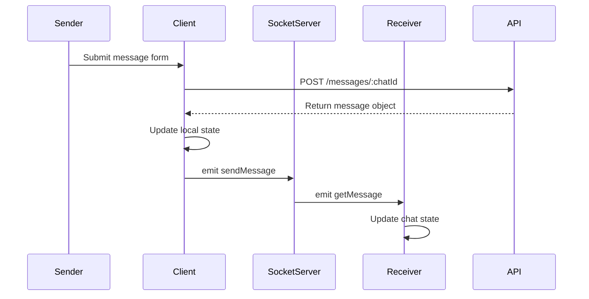
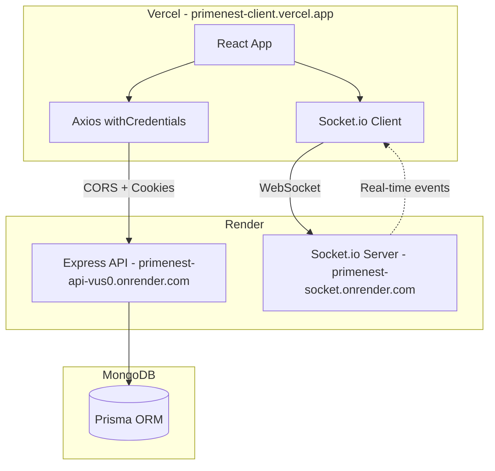

# CORS & Real-time Messaging Fix Plan

## Executive Summary

After analyzing your codebase, I've identified **two critical issues** causing the mobile CORS "Uplink Error" and potential real-time messaging problems.

---

## Issue 1: CORS Configuration Problems

### Current State Analysis

| File | Status | Issue |
|------|--------|-------|
| [`api/app.js`](api/app.js:15) | ✅ Correct | CORS origin without trailing slash, credentials enabled |
| [`client/src/lib/apiRequest.js`](client/src/lib/apiRequest.js:5) | ✅ Correct | `withCredentials: true` is set |
| [`api/controllers/auth.controller.js`](api/controllers/auth.controller.js:60) | ✅ Correct | Cookie has `sameSite: "none"`, `secure: true` |
| [`socket/app.js`](socket/app.js:6) | ❌ **PROBLEM** | Trailing slashes in origin array |
| [`client/vercel.json`](client/vercel.json:1) | ⚠️ Incomplete | Missing CORS headers |

### Root Cause: Socket Server CORS Origin

**Problem in [`socket/app.js`](socket/app.js:6):**
```javascript
origin: ["https://primenest-client.vercel.app/", "https://primenest-client.vercel.app/"],
```

**Issues:**
1. Both URLs have **trailing slashes** - mobile browsers are stricter about exact origin matching
2. **Duplicate entries** - both are identical

### Solution 1: Fix Socket Server CORS

**File:** [`socket/app.js`](socket/app.js:6)

Change from:
```javascript
origin: ["https://primenest-client.vercel.app/", "https://primenest-client.vercel.app/"],
```

To:
```javascript
origin: ["https://primenest-client.vercel.app"],
```

### Solution 2: Add CORS Headers to Vercel Config

**File:** [`client/vercel.json`](client/vercel.json:1)

Add headers for cross-origin requests:
```json
{
  "rewrites": [
    {
      "source": "/(.*)",
      "destination": "/index.html"
    }
  ],
  "headers": [
    {
      "source": "/(.*)",
      "headers": [
        { "key": "Access-Control-Allow-Credentials", "value": "true" },
        { "key": "Access-Control-Allow-Origin", "value": "https://primenest-api-vus0.onrender.com" },
        { "key": "Access-Control-Allow-Methods", "value": "GET,POST,PUT,DELETE,OPTIONS" },
        { "key": "Access-Control-Allow-Headers", "value": "Content-Type, Authorization" }
      ]
    }
  ]
}
```

---

## Issue 2: Real-time Messaging Not Refreshing Instantly

### Current Flow Analysis



### Problems Identified

1. **No connection status feedback** - Users don't know if socket is connected
2. **No reconnection handling** - If connection drops, no automatic recovery
3. **Message data incomplete** - The `chatId` check in [`Chat.jsx`](client/src/components/chat/Chat.jsx:65) may fail if data structure differs

### Solution: Enhanced Socket Context

**File:** [`client/src/context/SocketContext.jsx`](client/src/context/SocketContext.jsx:1)

Add connection status tracking and reconnection logic:

```javascript
import { createContext, useContext, useEffect, useState } from "react";
import { io } from "socket.io-client";
import { AuthContext } from "./AuthContext";

export const SocketContext = createContext();

export const SocketContextProvider = ({ children }) => {
  const { currentUser } = useContext(AuthContext);
  const [socket, setSocket] = useState(null);
  const [isConnected, setIsConnected] = useState(false);

  useEffect(() => {
    const newSocket = io("https://primenest-socket.onrender.com", {
      withCredentials: true,
      transports: ["websocket"],
      reconnection: true,
      reconnectionAttempts: 10,
      reconnectionDelay: 1000,
    });

    newSocket.on("connect", () => {
      console.log("Socket connected:", newSocket.id);
      setIsConnected(true);
    });

    newSocket.on("disconnect", () => {
      console.log("Socket disconnected");
      setIsConnected(false);
    });

    newSocket.on("connect_error", (err) => {
      console.error("Socket connection error:", err.message);
    });

    setSocket(newSocket);

    return () => {
      newSocket.close();
    };
  }, []);

  useEffect(() => {
    if (currentUser && socket && isConnected) {
      socket.emit("newUser", currentUser.id);
    }
  }, [currentUser, socket, isConnected]);

  return (
    <SocketContext.Provider value={{ socket, isConnected }}>
      {children}
    </SocketContext.Provider>
  );
};
```

### Solution: Improve Message Handling

**File:** [`client/src/components/chat/Chat.jsx`](client/src/components/chat/Chat.jsx:51)

The current implementation looks correct, but ensure the message data includes `chatId`:

```javascript
// In handleSubmit, ensure data includes chatId
socket.emit("sendMessage", {
  receiverId: chat.receiver.id,
  data: {
    ...res.data,
    chatId: chat.id,  // Ensure chatId is included
  },
});
```

---

## Implementation Checklist

### Phase 1: Fix CORS Issues
- [ ] Update [`socket/app.js`](socket/app.js:6) - Remove trailing slashes from origin
- [ ] Update [`client/vercel.json`](client/vercel.json:1) - Add CORS headers
- [ ] Redeploy socket server to Render
- [ ] Redeploy client to Vercel

### Phase 2: Fix Real-time Messaging
- [ ] Update [`client/src/context/SocketContext.jsx`](client/src/context/SocketContext.jsx:1) - Add connection status
- [ ] Update [`client/src/components/chat/Chat.jsx`](client/src/components/chat/Chat.jsx:42) - Ensure chatId in message data
- [ ] Add visual connection indicator in chat UI

### Phase 3: Testing
- [ ] Test on mobile device after deployment
- [ ] Verify cookie is set correctly in mobile browser
- [ ] Test real-time messaging between two users
- [ ] Test reconnection after network interruption

---

## Architecture Diagram



---

## Why Mobile Fails But Laptop Works

1. **Mobile browsers enforce stricter CORS policies** - They don't tolerate trailing slashes in origin matching
2. **Mobile networks have different timeout behaviors** - WebSocket connections may drop more frequently
3. **Mobile browsers handle third-party cookies differently** - Safari on iOS especially strict with `sameSite="none"`

---

## Additional Recommendations

1. **Add a connection status indicator** in the chat UI so users know if they're connected
2. **Implement message queuing** for offline scenarios
3. **Add error boundaries** around the chat component
4. **Consider using a unified domain** for API and client to avoid cross-origin complexity entirely
