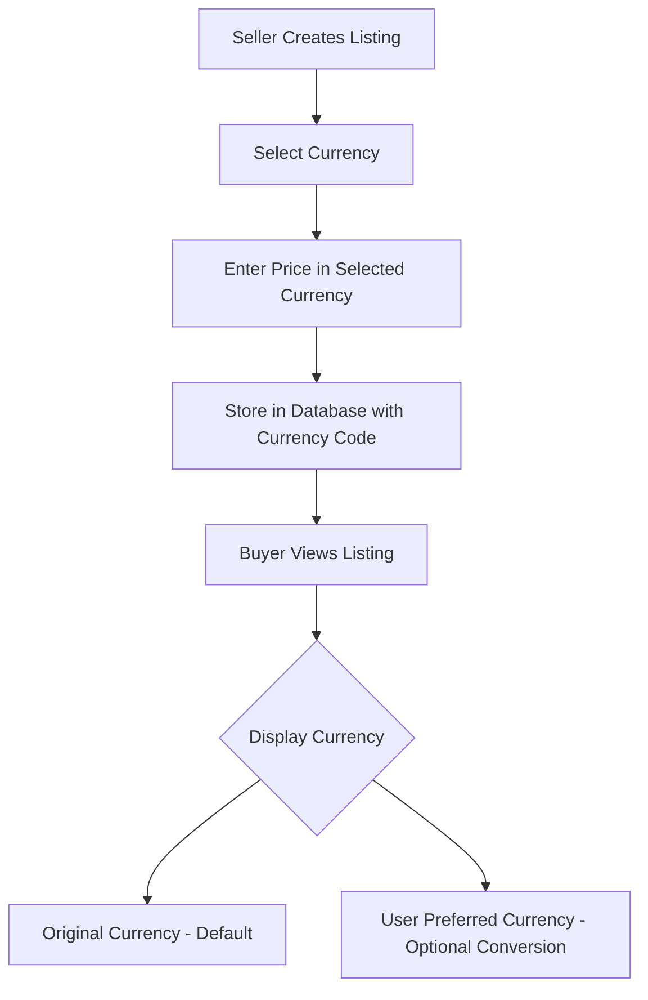

# Listing Updates Bug Fix & Multi-Currency System Implementation Plan

## Executive Summary

This plan addresses three critical issues in the PrimeNest application:
1. **Critical Bug**: Listing updates fail to persist due to an incomplete backend implementation
2. **Multi-Currency System**: Need to support international currencies instead of defaulting to USD
3. **UI Improvement**: Price range filter needs clearer Min/Max labels

---

## Issue 1: Critical Bug - Listing Updates Not Persisting

### Root Cause Analysis

The [`updatePost`](api/controllers/post.controller.js:116) controller in the backend is a placeholder that returns an empty response without actually updating the database:

```javascript
// UPDATE POST (Placeholder)
export const updatePost = async (req, res) => {
  try {
    res.status(200).json();  // Returns empty response - NO ACTUAL UPDATE!
  } catch (err) {
    console.log(err);
    res.status(500).json({ message: "Failed to update posts" });
  }
};
```

### Frontend Flow (Working Correctly)

The frontend [`newPostPage.jsx`](client/src/routes/newPostPage/newPostPage.jsx:75) correctly detects edit mode and sends a PUT request:

```javascript
if (data) {
  await apiRequest.put(`/posts/${data.id}`, postPayload);
  navigate("/" + data.id);
}
```

The route is properly configured in [`App.jsx`](client/src/App.jsx:52):
```javascript
{ path: "/edit/:id", element: <NewPostPage />, loader: singlePageLoader }
```

### Solution

Implement the full `updatePost` controller logic:

1. **Validate Authorization**: Verify the requesting user owns the post
2. **Update Post Data**: Update the main Post record
3. **Update Post Detail**: Update or create the nested PostDetail record
4. **Return Updated Post**: Respond with the updated post data

### Implementation Details

**File**: [`api/controllers/post.controller.js`](api/controllers/post.controller.js)

```javascript
export const updatePost = async (req, res) => {
  const id = req.params.id;
  const tokenUserId = req.userId;
  const body = req.body;

  try {
    // 1. Check if post exists and user is authorized
    const existingPost = await prisma.post.findUnique({
      where: { id },
      include: { postDetail: true }
    });

    if (!existingPost) {
      return res.status(404).json({ message: "Post not found!" });
    }

    if (existingPost.userId !== tokenUserId) {
      return res.status(403).json({ message: "Not Authorized!" });
    }

    // 2. Update the post
    const updatedPost = await prisma.post.update({
      where: { id },
      data: {
        ...body.postData,
        postDetail: {
          upsert: {
            create: body.postDetail,
            update: body.postDetail,
          },
        },
      },
      include: {
        postDetail: true,
        user: {
          select: {
            username: true,
            avatar: true,
          },
        },
      },
    });

    res.status(200).json(updatedPost);
  } catch (err) {
    console.log(err);
    res.status(500).json({ message: "Failed to update post" });
  }
};
```

---

## Issue 2: Multi-Currency System Implementation

### Current State

- **Database**: The [`Post`](api/prisma/schema.prisma:16) model only has a `price` field (Int) without currency information
- **Frontend**: Hardcoded USD symbol in [`newPostPage.jsx`](client/src/routes/newPostPage/newPostPage.jsx:140)
- **Utilities**: Currency detection and formatting already exist in [`utils.js`](client/src/lib/utils.js:11)

### Solution Architecture



### Database Schema Changes

**File**: [`api/prisma/schema.prisma`](api/prisma/schema.prisma:16)

Add a `currency` field to the Post model:

```prisma
model Post {
  id         String      @id @default(auto()) @map("_id") @db.ObjectId
  title      String
  price      Int
  currency   String      @default("USD")  // NEW: Currency code
  images     String[]
  address    String
  city       String
  country    String?
  bedroom    Int
  bathroom   Int
  latitude   String
  longitude  String
  type       Type
  property   Property
  createdAt  DateTime    @default(now())
  user       User        @relation(fields: [userId], references: [id])
  userId     String      @db.ObjectId
  postDetail PostDetail?
  savedPosts SavedPost[]
}
```

### Backend Changes

**File**: [`api/controllers/post.controller.js`](api/controllers/post.controller.js:78)

Update `addPost` to accept currency:

```javascript
const newPost = await prisma.post.create({
  data: {
    ...body.postData,
    currency: body.postData.currency || "USD",  // NEW: Default to USD
    country: country,
    userId: tokenUserId,
    postDetail: {
      create: body.postDetail,
    },
  },
});
```

Update `updatePost` to handle currency updates.

### Frontend Changes

#### 1. NewPostPage - Add Currency Selector

**File**: [`client/src/routes/newPostPage/newPostPage.jsx`](client/src/routes/newPostPage/newPostPage.jsx:139)

Replace the hardcoded price field with a currency selector + price input:

```jsx
<div className="form-group currency-group">
  <label>Price</label>
  <div className="price-input-wrapper">
    <select 
      name="currency" 
      defaultValue={data?.currency || "USD"}
      className="currency-select"
    >
      <option value="USD">USD $</option>
      <option value="NGN">NGN ₦</option>
      <option value="GBP">GBP £</option>
      <option value="EUR">EUR €</option>
      {/* Add more currencies as needed */}
    </select>
    <input
      name="price"
      type="number"
      defaultValue={data?.price}
      placeholder="Enter price"
      required
    />
  </div>
</div>
```

#### 2. Update Post Payload

Include currency in the post payload:

```javascript
const postPayload = {
  postData: {
    // ... existing fields
    currency: inputs.currency,  // NEW
  },
  // ...
};
```

#### 3. Display Components Update

**Files to Update**:
- [`Card.jsx`](client/src/components/card/Card.jsx:116) - Update price display
- [`singlePage.jsx`](client/src/routes/singlePage/singlePage.jsx:78) - Update formatPrice function
- [`Filter.jsx`](client/src/components/filter/Filter.jsx:28) - Update price slider

Create a new utility function for displaying prices with their original currency:

```javascript
// In utils.js
export const formatPostPrice = (price, currencyCode) => {
  const currencyData = CURRENCIES[currencyCode] || CURRENCIES.USD;
  return `${currencyData.symbol}${price.toLocaleString()}`;
};
```

---

## Issue 3: Price Range Filter Labels

### Current State

The [`SearchBar.jsx`](client/src/components/searchBar/SearchBar.jsx:74) component has ambiguous placeholders:

```jsx
<input
  type="number"
  name="minPrice"
  placeholder="Min price"  // Could be clearer
/>
<input
  type="number"
  name="maxPrice"
  placeholder="Max price"  // Could be clearer
/>
```

The [`Filter.jsx`](client/src/components/filter/Filter.jsx:66) component already has good labels but the SearchBar needs improvement.

### Solution

Update the SearchBar component with clearer labels:

**File**: [`client/src/components/searchBar/SearchBar.jsx`](client/src/components/searchBar/SearchBar.jsx:71)

```jsx
{/* Min Price */}
<div className="search-field price">
  <label className="field-label">Min</label>
  <DollarSign size={18} className="field-icon" />
  <input
    type="number"
    name="minPrice"
    min={0}
    placeholder="Min"
    value={query.minPrice}
    onChange={handleChange}
  />
</div>

{/* Max Price */}
<div className="search-field price">
  <label className="field-label">Max</label>
  <DollarSign size={18} className="field-icon" />
  <input
    type="number"
    name="maxPrice"
    min={0}
    placeholder="Max"
    value={query.maxPrice}
    onChange={handleChange}
  />
</div>
```

Add corresponding CSS for the labels:

```scss
.field-label {
  position: absolute;
  top: -8px;
  left: 8px;
  font-size: 10px;
  font-weight: 600;
  color: var(--text-muted);
  background: var(--bg-secondary);
  padding: 0 4px;
  border-radius: 4px;
}
```

---

## Implementation Order

1. **Phase 1: Critical Bug Fix**
   - Implement `updatePost` controller
   - Test listing updates end-to-end

2. **Phase 2: Database Schema Update**
   - Add `currency` field to Post model
   - Run Prisma migration
   - Update addPost controller

3. **Phase 3: Frontend Currency Support**
   - Add currency selector to NewPostPage
   - Update display components
   - Update Filter component

4. **Phase 4: UI Improvements**
   - Update SearchBar labels
   - Style improvements

---

## Testing Checklist

### Listing Updates
- [ ] Create a new listing
- [ ] Edit the listing and verify changes persist
- [ ] Edit listing images
- [ ] Edit listing details (description, amenities)
- [ ] Verify unauthorized users cannot edit others listings

### Multi-Currency
- [ ] Create listing with NGN (Naira)
- [ ] Create listing with GBP (Pounds)
- [ ] Create listing with USD (Dollars)
- [ ] Verify correct currency symbol displays on cards
- [ ] Verify correct currency symbol displays on single page
- [ ] Edit listing and change currency
- [ ] Filter by price works with different currencies

### Price Filter
- [ ] Min label is visible and clear
- [ ] Max label is visible and clear
- [ ] Price range filtering works correctly

---

## Files to Modify

| File | Changes |
|------|---------|
| [`api/controllers/post.controller.js`](api/controllers/post.controller.js) | Implement updatePost, add currency to addPost |
| [`api/prisma/schema.prisma`](api/prisma/schema.prisma) | Add currency field to Post model |
| [`client/src/routes/newPostPage/newPostPage.jsx`](client/src/routes/newPostPage/newPostPage.jsx) | Add currency selector |
| [`client/src/components/searchBar/SearchBar.jsx`](client/src/components/searchBar/SearchBar.jsx) | Add Min/Max labels |
| [`client/src/components/searchBar/searchBar.scss`](client/src/components/searchBar/searchBar.scss) | Style for labels |
| [`client/src/components/card/Card.jsx`](client/src/components/card/Card.jsx) | Use post currency for display |
| [`client/src/routes/singlePage/singlePage.jsx`](client/src/routes/singlePage/singlePage.jsx) | Use post currency for display |
| [`client/src/lib/utils.js`](client/src/lib/utils.js) | Add formatPostPrice utility |

---

## Risk Assessment

| Risk | Impact | Mitigation |
|------|--------|------------|
| Existing listings without currency | Medium | Default to USD for existing records |
| Currency conversion complexity | Low | Display original currency only (no conversion) |
| Migration downtime | Low | MongoDB allows schema flexibility |

---

## Notes

- The existing [`utils.js`](client/src/lib/utils.js) already has comprehensive currency utilities including detection, formatting, and symbol lookup
- The currency system will store the original currency - no real-time conversion needed
- Users will see prices in the currency the seller listed them
