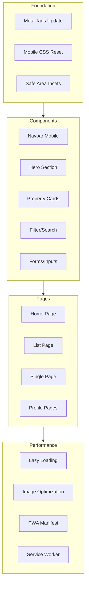

# Mobile-First Responsive Overhaul Plan v2.0

## Executive Summary

This plan outlines a comprehensive mobile-first responsive overhaul for the PrimeNest real estate platform. The desktop version (1024px+) is already polished and will remain untouched. All changes will be wrapped in `@media (max-width: 1024px)` or smaller breakpoints to preserve the existing desktop experience.

### Key Enhancements in v2.0
- **Bottom Navigation Bar** for thumb-friendly mobile navigation
- **Full Dark Mode Support** with `prefers-color-scheme: dark`
- **Responsive Images** with `srcset` for optimal loading
- **Map Performance Optimization** - critical fix for slow loading
- **Messages Page Mobile** - full usability on mobile devices

---

## Current State Analysis

### What's Working Well
- Modern design system with CSS variables (`_design-system.scss`)
- Existing responsive mixins (`mobile`, `tablet`, `desktop`)
- Glassmorphism effects and premium aesthetics
- Animation system with keyframes
- Dark/light theme support

### Critical Mobile Issues Identified

| Issue | Location | Impact | Priority |
|-------|----------|--------|----------|
| Missing viewport meta tags | `index.html` | Poor mobile rendering | HIGH |
| Touch targets too small | Cards, buttons, nav | Frustrating UX | HIGH |
| No hamburger menu optimization | Navbar | Navigation broken on mobile | HIGH |
| Grid layouts not optimized | List page, cards | Horizontal overflow | HIGH |
| Images not lazy-loaded | All pages | Slow performance | HIGH |
| **Map loading slow** | Map component | Poor UX on all devices | **CRITICAL** |
| No safe-area insets | Global | Notch overlap on iOS | MEDIUM |
| Typography not fluid | Global | Text too small/large | MEDIUM |
| No touch-action optimization | Global | Double-tap zoom issues | MEDIUM |
| Missing PWA features | Root | No offline support | LOW |
| Messages page not mobile-optimized | MessagesPage | Unusable on mobile | HIGH |

---

## Architecture Overview



---

## Phase 1: Foundation & Meta Tags

### 1.1 Update `client/index.html`

**Current:**
```html
<meta name="viewport" content="width=device-width, initial-scale=1.0" />
```

**New:**
```html
<meta name="viewport" content="width=device-width, initial-scale=1.0, viewport-fit=cover, shrink-to-fit=no">
<meta name="format-detection" content="telephone=no">
<meta name="theme-color" content="#6366F1">
<meta name="apple-mobile-web-app-capable" content="yes">
<meta name="apple-mobile-web-app-status-bar-style" content="black-translucent">
<link rel="apple-touch-icon" href="/favicon.png">
```

### 1.2 Add PWA Manifest

Create `client/public/manifest.json`:
```json
{
  "name": "PrimeNest - Real Estate Platform",
  "short_name": "PrimeNest",
  "description": "Buy, Sell and Rent Properties",
  "start_url": "/",
  "display": "standalone",
  "background_color": "#FAFAFA",
  "theme_color": "#6366F1",
  "icons": [
    {
      "src": "/favicon.png",
      "sizes": "192x192",
      "type": "image/png"
    }
  ]
}
```

---

## Phase 2: Global Mobile Styles & CSS Reset

### 2.1 Create Mobile-First Reset File

Create `client/src/styles/_mobile-reset.scss`:

```scss
// ============================================
// Mobile-First Reset & Optimizations
// ============================================

// Touch optimization
html {
  touch-action: manipulation;
  -webkit-tap-highlight-color: transparent;
  -webkit-touch-callout: none;
}

// Safe area insets for notched devices
@supports (padding: env(safe-area-inset-top)) {
  body {
    padding-top: env(safe-area-inset-top);
    padding-bottom: env(safe-area-inset-bottom);
    padding-left: env(safe-area-inset-left);
    padding-right: env(safe-area-inset-right);
  }
}

// Prevent horizontal scroll
html, body {
  overflow-x: hidden;
  max-width: 100vw;
  overscroll-behavior: none;
}

// Smooth scroll with momentum
* {
  -webkit-overflow-scrolling: touch;
  scroll-behavior: smooth;
}

// Touch target minimum
button, a, input, select, textarea {
  min-height: 44px;
  min-width: 44px;
}

// Disable hover states on touch devices
@media (hover: none) {
  *:hover {
    // Reset hover states
  }
}

// Respect reduced motion
@media (prefers-reduced-motion: reduce) {
  *, *::before, *::after {
    animation-duration: 0.01ms !important;
    animation-iteration-count: 1 !important;
    transition-duration: 0.01ms !important;
  }
}
```

### 2.2 Fluid Typography System

Add to `_design-system.scss`:

```scss
// Fluid typography with clamp()
$fluid-text-xs: clamp(0.625rem, 0.5rem + 0.5vw, 0.75rem);
$fluid-text-sm: clamp(0.75rem, 0.625rem + 0.5vw, 0.875rem);
$fluid-text-base: clamp(0.875rem, 0.75rem + 0.5vw, 1rem);
$fluid-text-lg: clamp(1rem, 0.875rem + 0.5vw, 1.125rem);
$fluid-text-xl: clamp(1.125rem, 0.875rem + 1vw, 1.25rem);
$fluid-text-2xl: clamp(1.25rem, 1rem + 1vw, 1.5rem);
$fluid-text-3xl: clamp(1.5rem, 1rem + 2vw, 1.875rem);
$fluid-text-4xl: clamp(1.75rem, 1rem + 3vw, 2.25rem);
$fluid-text-5xl: clamp(2rem, 1rem + 4vw, 3rem);
```

---

## Phase 3: Navigation/Header Mobile Overhaul

### 3.1 Navbar Mobile Enhancements

Update `client/src/components/navbar/navbar.scss`:

```scss
// Mobile-specific navbar styles
@media (max-width: 1023px) {
  .navbar {
    height: 60px;
    padding-top: env(safe-area-inset-top);
    
    .navbar-container {
      padding: 0 $space-3;
    }
    
    .logo {
      .logo-icon {
        width: 32px;
        height: 32px;
      }
    }
    
    .navbar-actions {
      gap: $space-1;
      
      .icon-btn {
        width: 40px;
        height: 40px;
      }
      
      .ai-btn .ai-btn-content {
        padding: $space-2 $space-3;
      }
    }
  }
}

// Mobile menu improvements
.mobile-menu {
  width: 100%;
  max-width: 100vw;
  right: 0;
  bottom: 0;
  top: 60px;
  height: calc(100vh - 60px);
  height: calc(100dvh - 60px);
  border-radius: $radius-2xl $radius-2xl 0 0;
  padding-bottom: env(safe-area-inset-bottom);
  
  // Thumb-friendly navigation
  .mobile-nav-link {
    padding: $space-4;
    font-size: $text-lg;
    min-height: 56px;
    
    svg {
      width: 24px;
      height: 24px;
    }
  }
}
```

### 3.2 Bottom Navigation Bar (Optional Enhancement)

Add a thumb-friendly bottom nav for key actions:

```scss
.mobile-bottom-nav {
  display: none;
  position: fixed;
  bottom: 0;
  left: 0;
  right: 0;
  height: calc(64px + env(safe-area-inset-bottom));
  background: var(--surface-glass);
  backdrop-filter: blur(20px);
  border-top: 1px solid var(--border-glass);
  z-index: $z-index-fixed;
  padding-bottom: env(safe-area-inset-bottom);
  
  @media (max-width: 1023px) {
    display: flex;
    justify-content: space-around;
    align-items: center;
  }
  
  .nav-item {
    display: flex;
    flex-direction: column;
    align-items: center;
    gap: $space-1;
    padding: $space-2;
    min-width: 64px;
    min-height: 44px;
    color: var(--text-tertiary);
    text-decoration: none;
    transition: color 0.15s ease;
    
    &.active {
      color: var(--accent-primary);
    }
    
    svg {
      width: 24px;
      height: 24px;
    }
    
    span {
      font-size: $text-xs;
      font-weight: $font-weight-medium;
    }
  }
}
```

---

## Phase 4: Hero Section Mobile Optimization

### 4.1 Hero Mobile Layout

Update `client/src/routes/homePage/homePage.scss`:

```scss
@media (max-width: 1023px) {
  .hero-section {
    min-height: auto;
    padding: $space-8 0;
    padding-top: calc($space-8 + env(safe-area-inset-top));
  }
  
  .hero-container {
    padding: 0 $space-4;
  }
  
  .hero-content {
    text-align: center;
  }
  
  .hero-badge {
    font-size: $text-xs;
    padding: $space-1-5 $space-3;
  }
  
  .hero-title {
    font-size: $fluid-text-4xl;
    line-height: 1.2;
  }
  
  .hero-description {
    font-size: $fluid-text-base;
    margin-bottom: $space-6;
  }
  
  // Search bar mobile
  .search-bar-wrapper {
    margin-top: $space-6;
  }
}
```

---

## Phase 5: Card Components Mobile Redesign

### 5.1 Property Card Mobile

Update `client/src/components/card/card.scss`:

```scss
@media (max-width: 767px) {
  .card {
    border-radius: $radius-lg;
    
    // Always show quick actions on mobile
    .card-image {
      aspect-ratio: 4 / 3;
      
      .quick-actions {
        opacity: 1;
        transform: translateY(0);
      }
      
      .type-badge {
        font-size: 8px;
        padding: 2px $space-1-5;
      }
      
      .price-badge {
        font-size: $text-xs;
        padding: 3px $space-1-5;
      }
    }
    
    .card-content {
      padding: $space-3;
      
      .card-title {
        font-size: $text-sm;
        @include line-clamp(1);
      }
      
      .card-location {
        font-size: $text-xs;
      }
      
      .card-stats {
        gap: $space-2;
        
        .stat {
          font-size: $text-xs;
          
          svg {
            width: 12px;
            height: 12px;
          }
        }
      }
    }
  }
}

// Touch-friendly action buttons
@media (max-width: 1023px) {
  .card .card-image .quick-actions .action-btn {
    width: 36px;
    height: 36px;
    
    svg {
      width: 16px;
      height: 16px;
    }
  }
}
```

---

## Phase 6: Filter & Search Components Mobile

### 6.1 Filter Mobile Optimization

Update `client/src/components/filter/filter.scss`:

```scss
@media (max-width: 767px) {
  .filter {
    border-radius: $radius-xl;
    margin: $space-3;
    
    .filter-header {
      padding: 0 $space-4;
      
      .header-content h1 {
        font-size: $text-lg;
      }
    }
    
    .filter-bar {
      padding: 0 $space-4;
      gap: $space-3;
      
      .filter-item {
        width: 100%;
        
        label {
          font-size: $text-xs;
        }
        
        input, select {
          padding: $space-3 $space-4;
          font-size: $text-base; // Prevents iOS zoom
          min-height: 48px;
        }
      }
    }
    
    // Collapsible filter sections
    .filter-section {
      border-bottom: 1px solid var(--border-default);
      
      .section-header {
        display: flex;
        justify-content: space-between;
        align-items: center;
        padding: $space-4;
        cursor: pointer;
        min-height: 56px;
        
        .section-title {
          font-size: $text-base;
          font-weight: $font-weight-medium;
        }
        
        .expand-icon {
          transition: transform 0.2s ease;
        }
      }
      
      .section-content {
        padding: 0 $space-4 $space-4;
        
        &.collapsed {
          display: none;
        }
      }
    }
  }
}
```

### 6.2 Search Bar Mobile

Update `client/src/components/searchBar/searchBar.scss`:

```scss
@media (max-width: 767px) {
  .search-bar {
    gap: $space-2;
  }
  
  .search-type-toggle {
    width: 100%;
    justify-content: center;
    
    .type-btn {
      flex: 1;
      padding: $space-3;
      min-height: 48px;
    }
  }
  
  .search-form {
    flex-direction: column;
    gap: $space-3;
    padding: $space-4;
    border-radius: $radius-xl;
  }
  
  .search-field {
    width: 100%;
    padding: $space-3 $space-4;
    background: var(--surface-secondary);
    border-radius: $radius-lg;
    min-height: 48px;
    
    input {
      font-size: $text-base; // Prevents iOS zoom
    }
  }
  
  .search-btn {
    width: 100%;
    padding: $space-4;
    min-height: 52px;
    font-size: $text-base;
  }
}
```

---

## Phase 7: List Page Mobile Layout

### 7.1 List Page Grid

Update `client/src/routes/listPage/listPage.scss`:

```scss
@media (max-width: 767px) {
  .list-page {
    min-height: 100vh;
    height: auto;
  }
  
  .view-toggle-mobile {
    position: sticky;
    top: 60px;
    z-index: 10;
    background: var(--surface-glass);
    backdrop-filter: blur(10px);
  }
  
  .list-content {
    display: block;
  }
  
  .properties-section {
    overflow: visible;
  }
  
  .properties-grid-wrapper {
    padding: $space-3;
  }
  
  .properties-grid {
    grid-template-columns: repeat(2, 1fr);
    gap: $space-2;
    
    // Single column for very small screens
    @media (max-width: 374px) {
      grid-template-columns: 1fr;
    }
  }
  
  .map-section {
    height: 50vh;
    position: relative;
  }
}
```

---

## Phase 8: Single Property Page Mobile

### 8.1 Single Page Mobile

Update `client/src/routes/singlePage/singlePage.scss`:

```scss
@media (max-width: 767px) {
  .single-page {
    min-height: 100vh;
  }
  
  .gallery-section {
    height: 35vh;
    min-height: 250px;
  }
  
  .content-wrapper {
    grid-template-columns: 1fr;
    padding: $space-4;
    gap: $space-6;
  }
  
  .property-header {
    gap: $space-3;
  }
  
  .header-top {
    flex-wrap: wrap;
    gap: $space-3;
  }
  
  .property-title-section {
    h1 {
      font-size: $text-2xl;
    }
    
    .location {
      font-size: $text-sm;
    }
  }
  
  .price-section .price {
    font-size: $text-2xl;
  }
  
  .quick-stats {
    grid-template-columns: repeat(2, 1fr);
    gap: $space-3;
    padding: $space-4;
    
    @media (max-width: 374px) {
      grid-template-columns: 1fr;
    }
  }
  
  // Sticky CTA at bottom
  .mobile-cta-bar {
    display: flex;
    position: fixed;
    bottom: 0;
    left: 0;
    right: 0;
    padding: $space-3;
    padding-bottom: calc($space-3 + env(safe-area-inset-bottom));
    background: var(--surface-glass);
    backdrop-filter: blur(20px);
    border-top: 1px solid var(--border-glass);
    gap: $space-2;
    z-index: $z-index-fixed;
    
    .cta-btn {
      flex: 1;
      padding: $space-3;
      min-height: 52px;
      font-size: $text-base;
      font-weight: $font-weight-semibold;
      border-radius: $radius-lg;
      display: flex;
      align-items: center;
      justify-content: center;
      gap: $space-2;
      
      &.primary {
        background: var(--brand-gradient);
        color: white;
      }
      
      &.secondary {
        background: var(--surface-secondary);
        color: var(--text-primary);
        border: 1px solid var(--border-default);
      }
    }
  }
}
```

---

## Phase 9: Map Performance Optimization (CRITICAL)

### 9.1 Problem Analysis

The map component is slow on both mobile and desktop due to:
- Loading all tiles immediately without lazy loading
- No tile caching strategy
- Heavy tile layer with full detail
- No performance optimizations for mobile

### 9.2 Map Lazy Loading with Intersection Observer

Update `client/src/components/map/Map.jsx`:

```jsx
import { MapContainer, TileLayer, useMap } from "react-leaflet";
import { useEffect, useState, useRef } from "react";
import L from "leaflet";
import "./map.scss";
import "leaflet/dist/leaflet.css";
import Pin from "../pin/Pin";

// Fix for missing marker icons
import markerIcon from "leaflet/dist/images/marker-icon.png";
import markerShadow from "leaflet/dist/images/marker-shadow.png";

let DefaultIcon = L.icon({
  iconUrl: markerIcon,
  shadowUrl: markerShadow,
  iconSize: [25, 41],
  iconAnchor: [12, 41],
});
L.Marker.prototype.options.icon = DefaultIcon;

function ChangeView({ center, zoom }) {
  const map = useMap();
  useEffect(() => {
    map.setView(center, zoom);
  }, [center, zoom, map]);
  return null;
}

function Map({ items }) {
  const [isVisible, setIsVisible] = useState(false);
  const mapRef = useRef(null);
  
  const center = items.length === 1
    ? [items[0].latitude, items[0].longitude]
    : [52.4797, -1.90269];

  // Lazy load map when it enters viewport
  useEffect(() => {
    const observer = new IntersectionObserver(
      ([entry]) => {
        if (entry.isIntersecting) {
          setIsVisible(true);
          observer.disconnect();
        }
      },
      { rootMargin: '200px' } // Start loading 200px before visible
    );

    if (mapRef.current) {
      observer.observe(mapRef.current);
    }

    return () => observer.disconnect();
  }, []);

  return (
    <div ref={mapRef} className="map-container">
      {isVisible ? (
        <MapContainer
          center={center}
          zoom={items.length === 1 ? 12 : 7}
          scrollWheelZoom={false}
          className="map"
          // Performance optimizations
          preferCanvas={true}
          zoomControl={true}
        >
          <ChangeView center={center} zoom={items.length === 1 ? 12 : 7} />
          <TileLayer
            attribution='&copy; OpenStreetMap &copy; CARTO'
            url="https://{s}.basemaps.cartocdn.com/rastertiles/voyager/{z}/{x}/{y}{r}.png"
            // Faster tile loading
            maxZoom={19}
            minZoom={3}
            updateWhenIdle={true}
            keepBuffer={2}
          />
          {items.map((item) => (
            <Pin item={item} key={item.id} />
          ))}
        </MapContainer>
      ) : (
        <div className="map-placeholder">
          <div className="map-loading-skeleton" />
        </div>
      )}
    </div>
  );
}

export default Map;
```

### 9.3 Map Mobile Styles

Update `client/src/components/map/map.scss`:

```scss
// Map container with lazy loading support
.map-container {
  width: 100%;
  height: 100%;
  position: relative;
}

.map-placeholder {
  width: 100%;
  height: 100%;
  display: flex;
  align-items: center;
  justify-content: center;
  background: var(--surface-secondary);
  border-radius: $radius-xl;
}

.map-loading-skeleton {
  width: 60%;
  height: 60%;
  background: linear-gradient(
    90deg,
    var(--surface-tertiary) 25%,
    var(--surface-hover) 50%,
    var(--surface-tertiary) 75%
  );
  background-size: 200% 100%;
  animation: shimmer 1.5s infinite;
  border-radius: $radius-lg;
}

@keyframes shimmer {
  0% { background-position: 200% 0; }
  100% { background-position: -200% 0; }
}

// Mobile-specific map styles
@media (max-width: 767px) {
  .map {
    border-radius: 0;
    
    // Larger touch targets for zoom controls
    .leaflet-control-zoom {
      margin: $space-3 !important;
      
      .leaflet-control-zoom-in,
      .leaflet-control-zoom-out {
        width: 44px !important;
        height: 44px !important;
        line-height: 44px !important;
        font-size: 20px !important;
      }
    }
    
    // Touch-friendly popups
    .leaflet-popup-content-wrapper {
      max-width: 280px;
    }
  }
}

// Dark mode map support
@media (prefers-color-scheme: dark) {
  .map {
    .leaflet-tile-container {
      filter: invert(1) hue-rotate(180deg) brightness(0.9) contrast(0.9);
    }
    
    .leaflet-popup-content-wrapper {
      background: var(--gray-800) !important;
      color: var(--text-primary);
    }
  }
}
```

---

## Phase 10: Messages Page Mobile Optimization

### 10.1 Messages Page Mobile Layout

Update `client/src/routes/messagesPage/messagesPage.scss`:

```scss
@media (max-width: 767px) {
  .messages-page {
    padding: 0;
    min-height: calc(100vh - 64px - env(safe-area-inset-bottom));
  }
  
  .messages-container {
    display: flex;
    flex-direction: column;
    height: calc(100vh - 64px);
    border-radius: 0;
  }
  
  // Conversations sidebar - full screen on mobile
  .conversations-sidebar {
    position: absolute;
    inset: 0;
    z-index: 10;
    width: 100%;
    transform: translateX(0);
    transition: transform 0.3s ease;
    
    &.hidden {
      transform: translateX(-100%);
    }
    
    .sidebar-header {
      padding: $space-4;
      padding-top: calc($space-4 + env(safe-area-inset-top));
      
      .header-title h1 {
        font-size: $text-lg;
      }
    }
    
    .conversation-item {
      padding: $space-4;
      min-height: 72px;
      
      .avatar {
        width: 48px;
        height: 48px;
      }
      
      .conversation-preview {
        .conversation-name {
          font-size: $text-base;
        }
        
        .last-message {
          font-size: $text-sm;
          @include line-clamp(1);
        }
      }
    }
  }
  
  // Chat area - full screen on mobile
  .chat-area {
    position: absolute;
    inset: 0;
    z-index: 5;
    
    &.active {
      z-index: 15;
    }
    
    .chat-header {
      padding: $space-4;
      padding-top: calc($space-4 + env(safe-area-inset-top));
      min-height: 64px;
      
      .back-button {
        display: flex;
        width: 44px;
        height: 44px;
        align-items: center;
        justify-content: center;
        margin-right: $space-2;
      }
      
      .chat-user-info {
        .user-name {
          font-size: $text-base;
        }
      }
    }
    
    .messages-list {
      padding: $space-4;
      padding-bottom: calc(80px + env(safe-area-inset-bottom));
      
      .message {
        max-width: 85%;
        padding: $space-3 $space-4;
        
        &.sent {
          margin-left: auto;
        }
        
        &.received {
          margin-right: auto;
        }
      }
    }
    
    // Sticky chat input at bottom
    .chat-input-container {
      position: fixed;
      bottom: 0;
      left: 0;
      right: 0;
      background: var(--surface-glass);
      backdrop-filter: blur(20px);
      border-top: 1px solid var(--border-glass);
      padding: $space-3;
      padding-bottom: calc($space-3 + env(safe-area-inset-bottom));
      z-index: $z-index-fixed;
      
      .chat-input-wrapper {
        display: flex;
        gap: $space-2;
        align-items: flex-end;
        
        .message-input {
          flex: 1;
          min-height: 48px;
          max-height: 120px;
          padding: $space-3 $space-4;
          font-size: 16px; // Prevents iOS zoom
          border-radius: $radius-xl;
          background: var(--surface-secondary);
          border: 1px solid var(--border-default);
          resize: none;
        }
        
        .send-button {
          width: 48px;
          height: 48px;
          border-radius: $radius-full;
          display: flex;
          align-items: center;
          justify-content: center;
          background: var(--brand-gradient);
          color: white;
          flex-shrink: 0;
          
          &:active {
            transform: scale(0.95);
          }
        }
      }
    }
  }
}

// Swipe gesture support for conversation list
.conversation-item {
  position: relative;
  overflow: hidden;
  
  .swipe-actions {
    position: absolute;
    right: 0;
    top: 0;
    bottom: 0;
    display: flex;
    transform: translateX(100%);
    transition: transform 0.2s ease;
    
    .swipe-action {
      width: 72px;
      height: 100%;
      display: flex;
      align-items: center;
      justify-content: center;
      
      &.delete {
        background: var(--error);
        color: white;
      }
      
      &.archive {
        background: var(--warning);
        color: white;
      }
    }
  }
  
  &.swiped .swipe-actions {
    transform: translateX(0);
  }
}
```

### 10.2 Messages Page Component Updates

Add back button and mobile navigation to `client/src/routes/messagesPage/MessagesPage.jsx`:

```jsx
// Add state for mobile view
const [showConversations, setShowConversations] = useState(true);
const [selectedChat, setSelectedChat] = useState(null);

// Handle chat selection on mobile
const handleSelectChat = (chat) => {
  setSelectedChat(chat);
  setShowConversations(false);
};

// Handle back to conversations
const handleBack = () => {
  setShowConversations(true);
};

// In JSX, add classes for mobile visibility
<div className={`conversations-sidebar ${showConversations ? 'open' : 'hidden'}`}>
  {/* ... */}
</div>

<div className={`chat-area ${!showConversations ? 'active' : ''}`}>
  {/* Add back button in header */}
  <button className="back-button" onClick={handleBack}>
    <ArrowLeftIcon />
  </button>
  {/* ... */}
</div>
```

---

## Phase 11: Forms & Inputs Mobile Optimization

### 11.1 Form Elements

Add to `client/src/index.scss`:

```scss
@media (max-width: 767px) {
  input, textarea, select {
    font-size: 16px; // Prevents iOS zoom on focus
    padding: $space-3 $space-4;
    min-height: 48px;
    border-radius: $radius-lg;
  }
  
  textarea {
    min-height: 120px;
  }
  
  button {
    min-height: 48px;
    padding: $space-3 $space-5;
    font-size: $text-base;
    
    &:active {
      transform: scale(0.98);
    }
  }
  
  // Form groups
  .form-group {
    margin-bottom: $space-4;
    
    label {
      display: block;
      margin-bottom: $space-2;
      font-size: $text-sm;
      font-weight: $font-weight-medium;
    }
  }
  
  // Checkbox and radio
  input[type="checkbox"],
  input[type="radio"] {
    width: 24px;
    height: 24px;
    min-height: auto;
  }
}
```

---

## Phase 12: Performance & PWA Features

### 10.1 Image Lazy Loading

Update all image components to include:

```jsx

```

### 10.2 Service Worker (Basic)

Create `client/public/sw.js`:

```javascript
const CACHE_NAME = 'primenest-v1';
const urlsToCache = [
  '/',
  '/index.html',
  '/favicon.png'
];

self.addEventListener('install', (event) => {
  event.waitUntil(
    caches.open(CACHE_NAME)
      .then((cache) => cache.addAll(urlsToCache))
  );
});

self.addEventListener('fetch', (event) => {
  event.respondWith(
    caches.match(event.request)
      .then((response) => response || fetch(event.request))
  );
});
```

### 10.3 Critical CSS Inline

Add critical above-the-fold styles inline in `index.html`:

```html
<style>
  /* Critical CSS for initial render */
  :root { --bg-primary: #FAFAFA; --text-primary: #0A0A0B; }
  body { margin: 0; font-family: 'Inter', sans-serif; }
  .navbar { position: sticky; top: 0; z-index: 200; }
</style>
```

---

## Phase 11: Accessibility & Touch Optimization

### 11.1 ARIA Labels

Add to interactive elements:

```jsx
<button aria-label="Open menu" aria-expanded={isOpen}>
  <MenuIcon aria-hidden="true" />
</button>

<nav aria-label="Main navigation">
  <a href="/" aria-current={isActive ? 'page' : undefined}>
    Home
  </a>
</nav>
```

### 11.2 Focus Management

```scss
// Visible focus states for keyboard nav
*:focus-visible {
  outline: 2px solid var(--accent-primary);
  outline-offset: 2px;
}

// Skip link for accessibility
.skip-link {
  position: absolute;
  top: -100%;
  left: 0;
  padding: $space-3 $space-4;
  background: var(--accent-primary);
  color: white;
  z-index: $z-index-max;
  
  &:focus {
    top: 0;
  }
}
```

### 11.3 Touch Target Audit

All interactive elements must meet:
- Minimum size: 44x44px (Apple HIG)
- Recommended: 48x48px (Google Material)
- Spacing between targets: 8px minimum

---

## Phase 12: Testing & Final Polish

### 12.1 Testing Checklist

- [ ] Chrome DevTools device emulation (iPhone SE, 12, 14 Pro Max, Galaxy S20)
- [ ] Real device testing (iOS Safari, Android Chrome)
- [ ] Landscape orientation
- [ ] Slow 3G network throttling
- [ ] Dark mode appearance
- [ ] Screen reader (VoiceOver, TalkBack)
- [ ] Keyboard navigation
- [ ] Touch target sizes
- [ ] No horizontal scroll at any breakpoint
- [ ] Lighthouse mobile score 95+

### 12.2 Breakpoint Summary

| Breakpoint | Target Devices |
|------------|----------------|
| 320px - 374px | iPhone SE, small phones |
| 375px - 413px | iPhone 12/13/14 standard |
| 414px - 767px | iPhone Pro Max, large phones |
| 768px - 1023px | Tablets (iPad, Android tablets) |
| 1024px+ | Desktop (unchanged) |

---

## Implementation Order

1. **Foundation** (index.html, meta tags, PWA manifest)
2. **Global Styles** (mobile reset, fluid typography, dark mode)
3. **Navigation** (hamburger menu, bottom nav)
4. **Core Components** (cards, search, filter)
5. **Map Optimization** (CRITICAL - lazy loading, performance)
6. **Pages** (home, list, single property)
7. **Messages Page** (mobile chat, swipe gestures)
8. **Forms** (inputs, buttons, validation)
9. **Performance** (lazy loading, service worker, responsive images)
10. **Accessibility** (ARIA, focus states)
11. **Testing** (all devices, Lighthouse)

---

## Files to Modify

| File | Changes | Priority |
|------|---------|----------|
| `client/index.html` | Meta tags, manifest link, critical CSS | HIGH |
| `client/src/styles/_design-system.scss` | Fluid typography, mobile mixins, dark mode | HIGH |
| `client/src/styles/_mobile-reset.scss` | New file - mobile reset | HIGH |
| `client/src/index.scss` | Import mobile reset, form styles | HIGH |
| `client/src/components/navbar/navbar.scss` | Mobile nav styles | HIGH |
| `client/src/components/navbar/Navbar.jsx` | Mobile menu component | HIGH |
| `client/src/components/navbar/BottomNav.jsx` | New file - bottom navigation | HIGH |
| `client/src/components/card/card.scss` | Mobile card styles | HIGH |
| `client/src/components/card/Card.jsx` | Responsive images with srcset | MEDIUM |
| `client/src/components/filter/filter.scss` | Mobile filter styles | MEDIUM |
| `client/src/components/searchBar/searchBar.scss` | Mobile search styles | MEDIUM |
| `client/src/components/map/Map.jsx` | Lazy loading, performance optimization | **CRITICAL** |
| `client/src/components/map/map.scss` | Mobile map styles, dark mode | **CRITICAL** |
| `client/src/routes/homePage/homePage.scss` | Mobile hero styles | MEDIUM |
| `client/src/routes/listPage/listPage.scss` | Mobile grid styles | HIGH |
| `client/src/routes/singlePage/singlePage.scss` | Mobile detail page | MEDIUM |
| `client/src/routes/messagesPage/MessagesPage.jsx` | Mobile chat navigation | HIGH |
| `client/src/routes/messagesPage/messagesPage.scss` | Mobile chat styles | HIGH |
| `client/public/manifest.json` | New file - PWA manifest | LOW |
| `client/public/sw.js` | New file - service worker | LOW |

---

## New Components to Create

### 1. BottomNav.jsx
A thumb-friendly bottom navigation bar for mobile devices with quick access to:
- Home
- Search/Listings
- Messages
- Profile

### 2. _mobile-reset.scss
Global mobile CSS reset with:
- Touch-action optimization
- Safe-area insets for notched devices
- Smooth scroll with momentum
- Touch target minimums
- Reduced motion support

---

## Responsive Image Strategy

### Image Component Pattern

```jsx
// Utility function for responsive images
export const getResponsiveImageUrl = (url, widths = [400, 800, 1200]) => {
  if (!url) return null;
  
  // For Cloudinary or similar services
  if (url.includes('cloudinary.com')) {
    return {
      src: url.replace('/upload/', `/upload/w_${widths[0]}/`),
      srcSet: widths.map(w => 
        `${url.replace('/upload/', `/upload/w_${w}/`)} ${w}w`
      ).join(', '),
      sizes: '(max-width: 480px) 100vw, (max-width: 768px) 50vw, 33vw'
    };
  }
  
  // For other URLs, return as-is with lazy loading
  return {
    src: url,
    loading: 'lazy',
    decoding: 'async'
  };
};
```

### Usage in Card Component

```jsx

```

---

## Dark Mode Mobile Support

### CSS Variables for Dark Mode

```scss
// Auto dark mode based on system preference
@media (prefers-color-scheme: dark) {
  :root {
    --bg-primary: #{$gray-950};
    --bg-secondary: #{$gray-900};
    --surface-primary: #{$gray-850};
    --surface-secondary: #{$gray-800};
    --text-primary: #{$gray-50};
    --text-secondary: #{$gray-300};
    --border-default: rgba(255, 255, 255, 0.1);
  }
}
```

---

## Success Metrics

- **Performance**: Lighthouse mobile score 95+
- **Accessibility**: WCAG 2.1 AA compliant
- **CLS**: Zero cumulative layout shift
- **LCP**: < 2.5s on 3G
- **FID**: < 100ms interaction delay
- **Touch Targets**: All 44x44px minimum
- **No horizontal scroll** at any viewport width
- **Map Load Time**: < 1s on 4G connection
