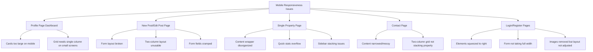

# Mobile Responsiveness Critical Fixes Plan

## Executive Summary

This plan addresses critical mobile responsiveness issues across 5 key pages/components in the PrimeNest application. The issues range from layout problems to unusable forms on mobile devices.

**Date Created:** February 18, 2026  
**Priority:** P0 - Critical  
**Status:** Planning Complete

---

## Issues Overview



---

## Detailed Analysis & Fixes

### 1. Profile Page - Dashboard Listing Cards

**File:** [`client/src/routes/profilePage/profilePage.scss`](client/src/routes/profilePage/profilePage.scss)

**Current Issue:**
- The cards grid in the dashboard uses `repeat(2, 1fr)` on mobile which makes cards too large
- Cards are cramped and hard to interact with on small screens

**Current Code (Problematic):**
```scss
// In card.scss - cards-grid
@include mobile {
  grid-template-columns: repeat(2, 1fr);
  gap: $space-2;
}
```

**Proposed Fix:**
```scss
// In profilePage.scss - add mobile-specific card grid overrides
.my-listings-grid {
  display: grid;
  grid-template-columns: repeat(3, 1fr);
  gap: $space-4;

  @include tablet {
    grid-template-columns: repeat(2, 1fr);
  }

  @include mobile {
    grid-template-columns: 1fr;  // Single column on mobile
    gap: $space-3;
  }
}
```

**Additional Changes:**
- Add specific class for profile page listing cards
- Ensure cards have proper touch targets on mobile
- Reduce card padding/margins on mobile for better space utilization

---

### 2. New Post / Edit Post Page

**File:** [`client/src/routes/newPostPage/newPostPage.scss`](client/src/routes/newPostPage/newPostPage.scss)

**Current Issues:**
1. Two-column layout (`1fr 400px`) becomes unusable on mobile
2. Form grid uses `@include sm` which may conflict with other breakpoints
3. Upload section sticky positioning causes issues on mobile
4. Form fields are cramped

**Current Code (Problematic):**
```scss
.new-post-page {
  display: grid;
  grid-template-columns: 1fr 400px;
  // ...
}

.form-grid {
  grid-template-columns: repeat(3, 1fr);
  // ...
}
```

**Proposed Fixes:**

```scss
// Main layout - force single column on tablet and mobile
.new-post-page {
  display: grid;
  grid-template-columns: 1fr 400px;
  min-height: calc(100vh - 80px);
  background: var(--bg-primary);

  @include lg {
    grid-template-columns: 1fr 340px;
  }

  @include tablet {
    grid-template-columns: 1fr;  // Single column
  }

  @include mobile {
    min-height: auto;
    display: flex;
    flex-direction: column;
  }
}

// Form section - ensure proper stacking order
.form-section {
  padding: $space-8;
  overflow-y: auto;

  @include tablet {
    padding: $space-5;
    order: 2;  // Form comes after upload on tablet
  }

  @include mobile {
    padding: $space-4;
    order: 2;  // Form comes after upload on mobile
  }
}

// Upload section - show first on mobile for better UX
.upload-section {
  // ...existing styles...
  
  @include tablet {
    position: relative;
    top: 0;
    height: auto;
    border-left: none;
    border-bottom: 1px solid var(--border-light);
    order: 1;  // Upload comes first on tablet
  }

  @include mobile {
    position: relative;
    top: 0;
    height: auto;
    padding: $space-4;
    border-left: none;
    border-bottom: 1px solid var(--border-light);
    order: 1;  // Upload comes first on mobile
  }
}

// Form grid - single column on mobile
.form-grid {
  display: grid;
  grid-template-columns: repeat(3, 1fr);
  gap: $space-5;

  @include lg {
    grid-template-columns: repeat(2, 1fr);
  }

  @include tablet {
    grid-template-columns: 1fr;  // Single column on tablet
  }

  @include mobile {
    grid-template-columns: 1fr;  // Single column on mobile
    gap: $space-4;
  }
}

// Form section groups - better padding on mobile
.form-section-group {
  // ...existing styles...
  
  @include mobile {
    padding: $space-4;
  }
}
```

---

### 3. Single Property Page

**File:** [`client/src/routes/singlePage/singlePage.scss`](client/src/routes/singlePage/singlePage.scss)

**Current Issues:**
1. Content wrapper grid doesn't collapse properly on mobile
2. Quick stats grid overflows
3. Sidebar column stacking is disorganized
4. Gallery height issues on very small screens

**Current Code (Problematic):**
```scss
.content-wrapper {
  display: grid;
  grid-template-columns: 1fr 400px;
  // ...
}

.quick-stats {
  display: grid;
  grid-template-columns: repeat(3, 1fr);
  // ...
}
```

**Proposed Fixes:**

```scss
// Gallery section - better mobile sizing
.gallery-section {
  width: 100%;
  height: 50vh;
  min-height: 400px;
  max-height: 600px;
  background: var(--surface-secondary);

  @include tablet {
    height: 40vh;
    min-height: 300px;
  }

  @include mobile {
    height: 30vh;  // Smaller on mobile
    min-height: 200px;
    max-height: 250px;
  }
}

// Content wrapper - proper mobile stacking
.content-wrapper {
  display: grid;
  grid-template-columns: 1fr 400px;
  gap: $space-8;
  max-width: 1400px;
  margin: 0 auto;
  padding: $space-8;
  width: 100%;

  @include lg {
    grid-template-columns: 1fr 360px;
    padding: $space-6;
    gap: $space-6;
  }

  @include tablet {
    grid-template-columns: 1fr;
    padding: $space-5;
  }

  @include mobile {
    display: flex;
    flex-direction: column;
    padding: $space-3;
    gap: $space-4;
  }
}

// Details column - mobile adjustments
.details-column {
  display: flex;
  flex-direction: column;
  gap: $space-8;

  @include mobile {
    gap: $space-4;
  }
}

// Property header - mobile adjustments
.property-header {
  display: flex;
  flex-direction: column;
  gap: $space-5;

  @include mobile {
    gap: $space-3;
  }
}

// Header top - stack on mobile
.header-top {
  display: flex;
  align-items: center;
  justify-content: space-between;

  @include mobile {
    flex-direction: column-reverse;
    align-items: flex-start;
    gap: $space-3;
  }
}

// Property title section - mobile font sizes
.property-title-section {
  h1 {
    font-size: $font-size-3xl;
    // ...

    @include sm {
      font-size: $font-size-2xl;
    }

    @include mobile {
      font-size: $font-size-xl;  // Smaller on mobile
    }
  }
}

// Price section - mobile adjustments
.price-section {
  .price {
    font-size: $font-size-4xl;

    @include sm {
      font-size: $font-size-3xl;
    }

    @include mobile {
      font-size: $font-size-2xl;  // Smaller on mobile
    }
  }
}

// Quick stats - single column on mobile
.quick-stats {
  display: grid;
  grid-template-columns: repeat(3, 1fr);
  gap: $space-4;
  padding: $space-5;
  background: var(--surface-secondary);
  border-radius: $radius-xl;
  border: 1px solid var(--border-light);

  @include sm {
    grid-template-columns: 1fr;
    gap: $space-3;
  }

  @include mobile {
    grid-template-columns: 1fr;  // Stack vertically on mobile
    gap: $space-2;
    padding: $space-3;
  }
}

// Sidebar column - show first on mobile for contact CTA
.sidebar-column {
  display: flex;
  flex-direction: column;
  gap: $space-5;

  @include md {
    order: -1;  // Sidebar first on tablet
  }

  @include mobile {
    order: -1;  // Sidebar first on mobile for prominent CTA
    gap: $space-4;
  }
}

// Agent card - mobile adjustments
.agent-card {
  padding: $space-6;
  // ...

  @include mobile {
    padding: $space-4;
  }
}

// Details card - mobile adjustments
.details-card {
  padding: $space-5;
  // ...

  @include mobile {
    padding: $space-4;
  }
}

// Amenities grid - mobile adjustments
.amenities-grid {
  display: flex;
  flex-direction: column;
  gap: $space-3;

  @include mobile {
    gap: $space-2;
  }
}

// Map wrapper - smaller on mobile
.map-wrapper {
  height: 200px;
  border-radius: $radius-lg;
  overflow: hidden;

  @include mobile {
    height: 150px;
  }
}

// Mobile save button - ensure visibility
.mobile-save-button {
  display: none;
  // ...

  @include md {
    display: flex;
  }

  @include mobile {
    display: flex;
    position: fixed;
    bottom: 0;
    left: 0;
    right: 0;
    z-index: 100;
    border-radius: 0;
    padding: $space-4 $space-4 calc($space-4 + env(safe-area-inset-bottom));
  }
}
```

---

### 4. Contact Page

**File:** [`client/src/routes/contactPage/contactPage.scss`](client/src/routes/contactPage/contactPage.scss)

**Current Issues:**
1. Two-column grid not stacking properly on mobile
2. Content appears narrowed and messy
3. Info section and form section need better mobile layouts

**Current Code (Problematic):**
```scss
.contact-page {
  display: grid;
  grid-template-columns: 1fr 1fr;
  // ...
}
```

**Proposed Fixes:**

```scss
// Main layout - stack on mobile
.contact-page {
  display: grid;
  grid-template-columns: 1fr 1fr;
  min-height: calc(100vh - 80px);
  background: var(--bg-primary);

  @include lg {
    grid-template-columns: 1fr;
  }

  @include mobile {
    display: flex;
    flex-direction: column;
    min-height: auto;
  }
}

// Info section - mobile adjustments
.contact-info-section {
  background: linear-gradient(135deg, var(--accent-primary), var(--accent-secondary));
  padding: $space-12;
  display: flex;
  align-items: center;

  @include lg {
    padding: $space-10 $space-6;
  }

  @include mobile {
    padding: $space-6 $space-4;
  }
}

// Info content - full width on mobile
.info-content {
  max-width: 500px;
  color: white;

  @include mobile {
    max-width: 100%;
  }

  h1 {
    font-size: $font-size-4xl;
    // ...

    @include sm {
      font-size: $font-size-3xl;
    }

    @include mobile {
      font-size: $font-size-2xl;  // Smaller on mobile
    }
  }

  > p {
    font-size: $font-size-lg;
    // ...

    @include mobile {
      font-size: $font-size-base;  // Smaller on mobile
      margin-bottom: $space-6;
    }
  }
}

// Contact details - mobile adjustments
.contact-details {
  display: flex;
  flex-direction: column;
  gap: $space-5;
  margin-bottom: $space-10;

  @include mobile {
    gap: $space-3;
    margin-bottom: $space-6;
  }
}

// Contact item - mobile adjustments
.contact-item {
  display: flex;
  align-items: center;
  gap: $space-4;

  @include mobile {
    gap: $space-3;
  }
}

// Item icon - smaller on mobile
.item-icon {
  width: 48px;
  height: 48px;
  // ...

  @include mobile {
    width: 40px;
    height: 40px;
  }
}

// Decorative card - hide on mobile to save space
.decorative-card {
  // ...existing styles...

  @include mobile {
    display: none;  // Hide decorative element on mobile
  }
}

// Form section - mobile adjustments
.contact-form-section {
  display: flex;
  align-items: center;
  justify-content: center;
  padding: $space-12;

  @include lg {
    padding: $space-10 $space-6;
  }

  @include mobile {
    padding: $space-6 $space-4;
    align-items: flex-start;  // Start from top on mobile
  }
}

// Form container - full width on mobile
.form-container {
  width: 100%;
  max-width: 480px;

  @include mobile {
    max-width: 100%;
  }
}

// Form header - mobile adjustments
.form-header {
  margin-bottom: $space-8;

  @include mobile {
    margin-bottom: $space-5;
  }

  h2 {
    font-size: $font-size-2xl;
    // ...

    @include mobile {
      font-size: $font-size-xl;
    }
  }
}

// Contact form - mobile adjustments
.contact-form {
  display: flex;
  flex-direction: column;
  gap: $space-5;

  @include mobile {
    gap: $space-4;
  }
}
```

---

### 5. Login / Register Pages

**File:** [`client/src/routes/login/login.scss`](client/src/routes/login/login.scss)

**Current Issues:**
1. Elements are squeezed to the right side
2. Form not taking full width since images were removed
3. Auth form container has restrictive max-width

**Current Code (Problematic):**
```scss
.auth-page {
  display: grid;
  grid-template-columns: 1fr 1fr;
  // ...
}

.auth-form-container {
  width: 100%;
  max-width: 400px;
}
```

**Proposed Fixes:**

```scss
// Auth page layout - single column on mobile/tablet
.auth-page {
  display: grid;
  grid-template-columns: 1fr 1fr;
  min-height: calc(100vh - 64px);
  background: var(--bg-primary);

  @include lg {
    grid-template-columns: 1fr;
  }

  @include mobile {
    display: flex;
    flex-direction: column;
    min-height: calc(100vh - 56px);
  }
}

// Auth form section - center properly on mobile
.auth-form-section {
  display: flex;
  align-items: center;
  justify-content: center;
  padding: $space-8;

  @include mobile {
    padding: $space-6 $space-4;
    align-items: flex-start;  // Start from top on mobile
    padding-top: $space-8;
  }
}

// Auth form container - full width on mobile
.auth-form-container {
  width: 100%;
  max-width: 400px;

  @include mobile {
    max-width: 100%;  // Take full width on mobile
  }
}

// Auth logo - mobile adjustments
.auth-logo {
  display: flex;
  align-items: center;
  gap: $space-3;
  text-decoration: none;
  margin-bottom: $space-8;

  @include mobile {
    margin-bottom: $space-6;
    justify-content: center;  // Center logo on mobile
  }
}

// Auth header - mobile adjustments
.auth-header {
  margin-bottom: $space-8;

  @include mobile {
    margin-bottom: $space-6;
    text-align: center;  // Center header on mobile
  }

  h1 {
    font-size: $text-3xl;
    // ...

    @include mobile {
      font-size: $text-2xl;  // Smaller on mobile
    }
  }

  p {
    font-size: $text-base;
    // ...

    @include mobile {
      font-size: $text-sm;  // Smaller on mobile
    }
  }
}

// Auth form - mobile adjustments
.auth-form {
  display: flex;
  flex-direction: column;
  gap: $space-5;

  @include mobile {
    gap: $space-4;
  }
}

// Form options - stack on mobile
.form-options {
  display: flex;
  align-items: center;
  justify-content: space-between;

  @include mobile {
    flex-direction: column;
    align-items: flex-start;
    gap: $space-3;
  }
}

// Auth switch - mobile adjustments
.auth-switch {
  margin-top: $space-8;
  text-align: center;

  @include mobile {
    margin-top: $space-6;
  }
}

// Auth image section - ensure hidden on mobile/tablet
.auth-image-section {
  position: relative;
  overflow: hidden;

  @include max-lg {
    display: none;  // Hide on screens smaller than 1024px
  }
}
```

---

## Implementation Order

1. **Login/Register Pages** - Highest priority as users can't authenticate on mobile
2. **New Post/Edit Post Page** - Critical for user engagement
3. **Single Property Page** - Core user journey
4. **Contact Page** - Important for user communication
5. **Profile Page Dashboard** - User account management

---

## Testing Checklist

After implementation, test the following on mobile viewports (320px - 767px):

### Login/Register
- [ ] Form is centered and takes full width
- [ ] All form fields are accessible
- [ ] Submit button is easily tappable
- [ ] Logo and header are properly sized

### New Post/Edit Post
- [ ] Form sections stack vertically
- [ ] Upload section appears first
- [ ] All form fields are accessible
- [ ] Form grids collapse to single column
- [ ] Submit button is visible and tappable

### Single Property Page
- [ ] Gallery is properly sized
- [ ] Content stacks in logical order
- [ ] Agent/contact card is prominent
- [ ] Quick stats don't overflow
- [ ] Save button is accessible

### Contact Page
- [ ] Info section stacks above form
- [ ] Form takes full width
- [ ] All fields are accessible
- [ ] Submit button is tappable

### Profile Dashboard
- [ ] Listing cards are single column
- [ ] Cards are properly sized
- [ ] Edit/Delete buttons are tappable
- [ ] Sidebar stacks properly

---

## Files to Modify

| File | Changes |
|------|---------|
| `client/src/routes/login/login.scss` | Full-width form layout on mobile |
| `client/src/routes/register/register.scss` | Same as login |
| `client/src/routes/newPostPage/newPostPage.scss` | Single column layout, proper stacking order |
| `client/src/routes/singlePage/singlePage.scss` | Content stacking, mobile sizing |
| `client/src/routes/contactPage/contactPage.scss` | Proper stacking, full-width form |
| `client/src/routes/profilePage/profilePage.scss` | Single column card grid |
| `client/src/components/card/card.scss` | Mobile card sizing adjustments |

---

## Notes

- All fixes use the existing design system mixins from `_design-system.scss`
- Breakpoints used: `@include mobile` (max-width: 767px), `@include tablet` (768px - 1023px)
- Touch targets should be minimum 44px for accessibility
- Safe area insets should be considered for notched devices
