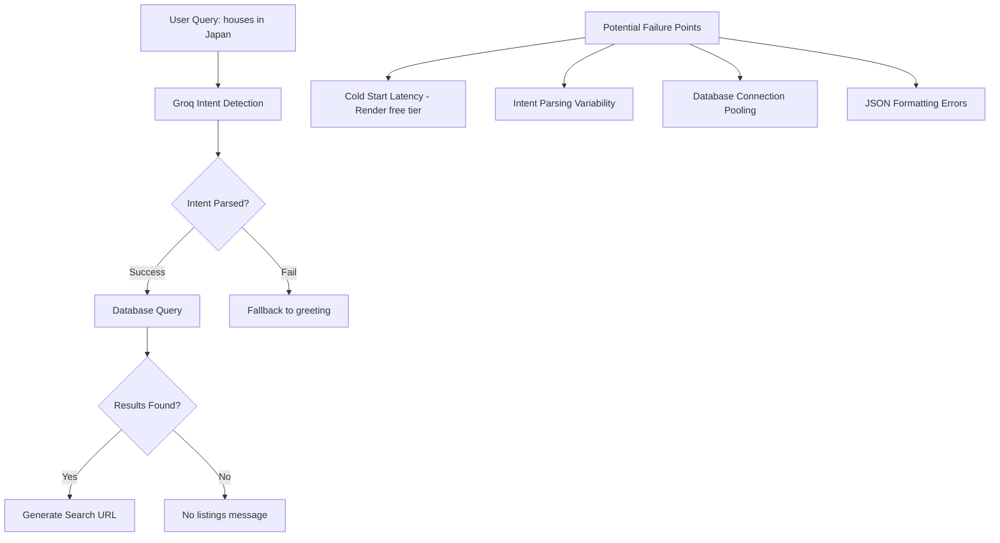
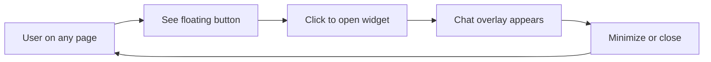

# PrimeNest Comprehensive Overhaul Plan

## Executive Summary

This document outlines a complete transformation of the PrimeNest real estate platform, addressing:
1. AI Chatbot intermittent recognition issues
2. Complete UI/UX redesign with a new earth-tone color palette
3. Enhanced components and features
4. AI Chatbot widget transformation
5. Modern polish with animations and micro-interactions

---

## Phase 1: AI Chatbot Debugging & Optimization

### Problem Analysis

The intermittent "houses in Japan" recognition issue stems from multiple potential causes:



### Root Causes Identified

1. **Cold Start Latency**: Render free tier spins down after inactivity
2. **Intent Parsing Variability**: Groq may return inconsistent formats
3. **Database Connection**: Prisma connection may timeout on first request
4. **JSON Parsing**: Gemini may return malformed JSON

### Solutions

#### 1.1 Backend Controller Optimization

**File:** [`api/controllers/assistant.controller.js`](api/controllers/assistant.controller.js)

```javascript
// Add retry logic and connection warming
export const chatWithAssistant = async (req, res) => {
  const { message } = req.body;

  // Add request timeout handling
  const timeoutPromise = new Promise((_, reject) => 
    setTimeout(() => reject(new Error('Request timeout')), 25000)
  );

  try {
    // Warm up database connection on first request
    await prisma.$connect();
    
    // Improved intent detection with fallback
    const intentResult = await Promise.race([
      detectIntent(message),
      timeoutPromise
    ]);
    
    // ... rest of implementation
  } catch (err) {
    // Graceful degradation
  }
};
```

#### 1.2 Intent Detection Improvements

- Add multiple intent detection attempts
- Implement fuzzy matching for location extraction
- Cache frequent queries

#### 1.3 Database Query Optimization

- Add database indexes on city, country, address fields
- Implement query caching for common searches
- Use connection pooling

---

## Phase 2: Design System & Color Palette

### New Color Palette

Based on the earth-tone palette from Coolors:

| Color Name | Hex Code | Usage |
|------------|----------|-------|
| Sage | `#CCD5AE` | Primary accent, buttons, highlights |
| Cream | `#E9EDC9` | Secondary backgrounds, cards |
| Off-White | `#FEFAE0` | Main background, text areas |
| Sand | `#FAEDCD` | Hover states, secondary accents |
| Terracotta | `#D4A373` | CTAs, important elements, brand accent |

### Extended Palette

```scss
// Primary Colors
$color-sage: #CCD5AE;
$color-cream: #E9EDC9;
$color-offwhite: #FEFAE0;
$color-sand: #FAEDCD;
$color-terracotta: #D4A373;

// Extended Neutrals
$color-dark: #2C2C2C;
$color-charcoal: #3D3D3D;
$color-gray: #6B6B6B;
$color-light-gray: #9A9A9A;

// Semantic Colors
$color-success: #7CB07E;
$color-warning: #E8C547;
$color-error: #D47373;
$color-info: #73A9D4;

// Gradients
$gradient-primary: linear-gradient(135deg, $color-sage, $color-terracotta);
$gradient-subtle: linear-gradient(180deg, $color-offwhite, $color-cream);
$gradient-hero: linear-gradient(135deg, rgba(212, 163, 115, 0.1), rgba(204, 213, 174, 0.1));
```

### Typography System

```scss
// Font Stack
$font-primary: 'Inter', -apple-system, BlinkMacSystemFont, sans-serif;
$font-display: 'Playfair Display', Georgia, serif;
$font-mono: 'JetBrains Mono', monospace;

// Type Scale
$font-size-xs: 0.75rem;    // 12px
$font-size-sm: 0.875rem;   // 14px
$font-size-base: 1rem;     // 16px
$font-size-lg: 1.125rem;   // 18px
$font-size-xl: 1.25rem;    // 20px
$font-size-2xl: 1.5rem;    // 24px
$font-size-3xl: 2rem;      // 32px
$font-size-4xl: 2.5rem;    // 40px
$font-size-5xl: 3rem;      // 48px
$font-size-6xl: 4rem;      // 64px
```

### Spacing System

```scss
$space-1: 0.25rem;   // 4px
$space-2: 0.5rem;    // 8px
$space-3: 0.75rem;   // 12px
$space-4: 1rem;      // 16px
$space-5: 1.5rem;    // 24px
$space-6: 2rem;      // 32px
$space-7: 2.5rem;    // 40px
$space-8: 3rem;      // 48px
$space-10: 4rem;     // 64px
$space-12: 5rem;     // 80px
$space-16: 8rem;     // 128px
```

---

## Phase 3: Component Redesign

### 3.1 Navbar Redesign

**Current Issues:**
- Purple accent colors
- Basic mobile menu
- Limited visual hierarchy

**New Design:**
- Clean, minimal design with earth tones
- Glassmorphism effect with subtle blur
- Improved mobile menu with slide animation
- Floating AI assistant button

### 3.2 Card Component Redesign

**New Features:**
- Elevated card design with soft shadows
- Image hover zoom effect
- Price badge redesign
- Improved feature icons
- Save/favorite animation

### 3.3 Filter Component Redesign

**New Features:**
- Sliding price range filter (dual-handle slider)
- Animated dropdown selects
- Clear all filters button
- Active filter chips
- Collapsible on mobile

### 3.4 SearchBar Component Redesign

**New Features:**
- Larger, more prominent search input
- Animated search icon
- Location autocomplete suggestions
- Recent searches dropdown
- Voice search button (optional)

---

## Phase 4: AI Chatbot Widget Transformation

### Current State
- Dedicated full page at `/assistant`
- Fixed input at bottom
- Hero section with features

### New State: Floating Widget



### Widget Design Specifications

**Position:** Fixed bottom-right corner
**Size:** 380px width, 500px height (expanded)
**Collapsed:** 60px circular button

**Features:**
- Smooth open/close animation
- Minimizable to bubble
- Chat history persistence
- Typing indicators
- Message timestamps
- Quick action buttons

### Implementation Structure

```jsx
// New component: AIWidget.jsx
<div className="ai-widget">
  {/* Collapsed State */}
  <button className="widget-trigger" onClick={toggleWidget}>
    <AIIcon />
    <span className="pulse-ring"></span>
  </button>
  
  {/* Expanded State */}
  <div className={`widget-panel ${isOpen ? 'open' : ''}`}>
    <header>
      <h3>Runo AI</h3>
      <button onClick={minimize}>—</button>
    </header>
    <div className="messages">
      {/* Chat messages */}
    </div>
    <footer>
      <input />
      <button>Send</button>
    </footer>
  </div>
</div>
```

---

## Phase 5: Messaging Section Enhancement

### Current Issues
- Basic chat UI
- Limited visual feedback
- No typing indicators

### New Features

1. **Modern Chat Interface**
   - Message bubbles with timestamps
   - Read receipts
   - Typing indicators
   - Online status indicators

2. **Enhanced User List**
   - Avatar with online status
   - Last message preview
   - Unread message count
   - Search conversations

3. **Message Input**
   - Emoji picker
   - File attachment
   - Voice message (optional)

---

## Phase 6: Animations & Micro-interactions

### Animation Library

Use Framer Motion for smooth animations:

```bash
npm install framer-motion
```

### Key Animations

1. **Page Transitions**
   ```jsx
   const pageVariants = {
     initial: { opacity: 0, y: 20 },
     animate: { opacity: 1, y: 0 },
     exit: { opacity: 0, y: -20 }
   };
   ```

2. **Card Hover Effects**
   - Subtle lift (translateY: -8px)
   - Shadow enhancement
   - Image zoom (scale: 1.05)

3. **Button Interactions**
   - Ripple effect on click
   - Scale down on press
   - Loading spinner animation

4. **Form Inputs**
   - Focus ring animation
   - Label float animation
   - Error shake animation

5. **AI Widget**
   - Slide up on open
   - Bubble pulse animation
   - Message appear animation

---

## Phase 7: Implementation Roadmap

### Week 1: Foundation
- [ ] Create new design system file (_design-system.scss)
- [ ] Update color palette across all components
- [ ] Implement typography system
- [ ] Add spacing utilities

### Week 2: Core Components
- [ ] Redesign Navbar
- [ ] Redesign Card component
- [ ] Redesign Filter with price slider
- [ ] Redesign SearchBar

### Week 3: AI Widget
- [ ] Create AIWidget component
- [ ] Implement floating button
- [ ] Add open/close animations
- [ ] Migrate chat logic from page to widget
- [ ] Update routing

### Week 4: Messaging & Polish
- [ ] Enhance messaging UI
- [ ] Add animations throughout
- [ ] Mobile responsiveness testing
- [ ] Performance optimization
- [ ] Final QA

---

## File Structure After Overhaul

```
client/src/
├── styles/
│   ├── _design-system.scss    # New: Colors, typography, spacing
│   ├── _animations.scss       # New: Keyframes, transitions
│   ├── _utilities.scss        # New: Helper classes
│   └── index.scss             # Updated: Import all
├── components/
│   ├── navbar/
│   ├── card/
│   ├── filter/
│   ├── searchBar/
│   ├── ai-widget/             # New: Floating AI chat
│   │   ├── AIWidget.jsx
│   │   └── aiWidget.scss
│   └── chat/                  # Enhanced messaging
├── context/
│   └── AIWidgetContext.jsx    # New: Widget state management
└── routes/
    └── assistantPage/         # Repurpose or remove
```

---

## Technical Considerations

### Performance
- Lazy load AI widget component
- Debounce search inputs
- Virtualize long message lists
- Optimize images with WebP

### Accessibility
- ARIA labels for all interactive elements
- Keyboard navigation support
- Color contrast compliance (WCAG AA)
- Screen reader announcements

### Browser Support
- Modern browsers (Chrome, Firefox, Safari, Edge)
- iOS Safari specific fixes
- Android Chrome optimization

---

## Confirmed Requirements

1. **Price Slider Range:** $0 - $10M with dynamic currency based on location
2. **Dark Mode:** Yes, implement light/dark mode toggle
3. **Animation Preferences:** Full animations enabled (no reduced motion respect)
4. **Currency Detection:** Based on user location/browser locale

---

## Implementation Order

### Step 1: Design System Foundation
- Create `_design-system.scss` with light/dark themes
- Implement CSS variables for theming
- Add currency utility functions

### Step 2: Core Components
- Redesign Navbar with theme toggle
- Redesign Card component
- Redesign Filter with price slider
- Redesign SearchBar

### Step 3: AI Widget
- Create floating AI widget component
- Implement open/close animations
- Migrate chat logic

### Step 4: Messaging Enhancement
- Modernize chat UI
- Add typing indicators
- Improve message bubbles

### Step 5: Backend Optimization
- Fix AI chatbot intermittent issues
- Add retry logic
- Implement connection warming
